## What this run builds, and what it reuses

`js` schedules **39 build tasks**: **39 rebuilt** because they changed, and **0 expected from cache** — pulled in by `dependsOn: ["^build"]` because a consumer needs their `dist`, not because anything about them moved.

This is the whole of why an incremental push costs minutes rather than tens of minutes,
and it is the one thing the job graph above cannot show.

```mermaid
flowchart BT
  subgraph g_frontend_api_doc_viewer["api-doc-viewer"]
    p_api_doc_viewer["api-doc-viewer"]:::changed
    p_api_doc_viewer_api_data_model["api-doc-viewer-api-data-model"]:::changed
    p_api_doc_viewer_api_state_model["api-doc-viewer-api-state-model"]:::changed
    p_api_doc_viewer_next_data_model["api-doc-viewer-next-data-model"]:::changed
    p_api_doc_viewer_root["api-doc-viewer-root"]:::changed
    p_api_doc_viewer_samples["api-doc-viewer-samples"]:::changed
  end
  subgraph g_frontend_apispec_view["apispec-view"]
    p_apispec_view["apispec-view"]:::changed
    p_apispec_view_diff_block["apispec-view-diff-block"]:::changed
    p_apispec_view_diff_elements_core["apispec-view-diff-elements-core"]:::changed
    p_apispec_view_elements_core["apispec-view-elements-core"]:::changed
    p_apispec_view_json_schema_diff_viewer["apispec-view-json-schema-diff-viewer"]:::changed
    p_apispec_view_json_schema_viewer["apispec-view-json-schema-viewer"]:::changed
    p_apispec_view_root["apispec-view-root"]:::changed
    p_apispec_view_samples["apispec-view-samples"]:::changed
  end
  subgraph g_frontend_ui["ui"]
    p_ui_agents["ui-agents"]:::changed
    p_ui_portal["ui-portal"]:::changed
    p_ui_root["ui-root"]:::changed
    p_ui_shared["ui-shared"]:::changed
  end
  p_agent["agent"]:::changed
  p_agents_backend["agents-backend"]:::changed
  p_api_diff["api-diff"]:::changed
  p_api_linter_service["api-linter-service"]:::changed
  p_api_processor["api-processor"]:::changed
  p_api_unifier["api-unifier"]:::changed
  p_api_visitor["api-visitor"]:::changed
  p_build_task_consumer["build-task-consumer"]:::changed
  p_class_view["class-view"]:::changed
  p_commons_go["commons-go"]:::changed
  p_compatibility_suites["compatibility-suites"]:::changed
  p_ddlapi["ddlapi"]:::changed
  p_graphapi["graphapi"]:::changed
  p_http_spec["http-spec"]:::changed
  p_jest_chrome_in_docker_environment["jest-chrome-in-docker-environment"]:::changed
  p_json_crawl["json-crawl"]:::changed
  p_portal_backend["portal-backend"]:::changed
  p_rest_playground["rest-playground"]:::changed
  p_test_service["test-service"]:::changed
  p_ui_tests["ui-tests"]:::changed
  p_vscode["vscode"]:::changed
  p_commons_go --> p_agents_backend
  p_compatibility_suites --> p_api_diff
  p_graphapi --> p_api_diff
  p_api_unifier --> p_api_diff
  p_ddlapi --> p_api_diff
  p_json_crawl --> p_api_diff
  p_jest_chrome_in_docker_environment --> p_api_doc_viewer
  p_compatibility_suites --> p_api_doc_viewer
  p_compatibility_suites --> p_api_doc_viewer
  p_api_doc_viewer_api_data_model --> p_api_doc_viewer
  p_api_doc_viewer_api_state_model --> p_api_doc_viewer
  p_api_doc_viewer_next_data_model --> p_api_doc_viewer
  p_api_doc_viewer_samples --> p_api_doc_viewer
  p_api_diff --> p_api_doc_viewer
  p_api_unifier --> p_api_doc_viewer
  p_ddlapi --> p_api_doc_viewer
  p_ddlapi --> p_api_doc_viewer
  p_graphapi --> p_api_doc_viewer
  p_json_crawl --> p_api_doc_viewer
  p_api_diff --> p_api_doc_viewer_api_data_model
  p_api_unifier --> p_api_doc_viewer_api_data_model
  p_graphapi --> p_api_doc_viewer_api_data_model
  p_json_crawl --> p_api_doc_viewer_api_data_model
  p_api_doc_viewer_api_data_model --> p_api_doc_viewer_api_state_model
  p_graphapi --> p_api_doc_viewer_api_state_model
  p_api_doc_viewer --> p_api_doc_viewer_api_state_model
  p_api_diff --> p_api_doc_viewer_next_data_model
  p_api_unifier --> p_api_doc_viewer_next_data_model
  p_ddlapi --> p_api_doc_viewer_next_data_model
  p_json_crawl --> p_api_doc_viewer_next_data_model
  p_compatibility_suites --> p_api_doc_viewer_root
  p_jest_chrome_in_docker_environment --> p_api_doc_viewer_root
  p_api_diff --> p_api_doc_viewer_root
  p_api_unifier --> p_api_doc_viewer_root
  p_ddlapi --> p_api_doc_viewer_root
  p_graphapi --> p_api_doc_viewer_root
  p_json_crawl --> p_api_doc_viewer_root
  p_commons_go --> p_api_linter_service
  p_api_diff --> p_api_processor
  p_api_unifier --> p_api_processor
  p_ddlapi --> p_api_processor
  p_graphapi --> p_api_processor
  p_json_crawl --> p_api_processor
  p_ddlapi --> p_api_unifier
  p_graphapi --> p_api_unifier
  p_json_crawl --> p_api_unifier
  p_api_unifier --> p_api_visitor
  p_json_crawl --> p_api_visitor
  p_jest_chrome_in_docker_environment --> p_apispec_view
  p_apispec_view_root --> p_apispec_view
  p_compatibility_suites --> p_apispec_view
  p_api_diff --> p_apispec_view
  p_api_doc_viewer --> p_apispec_view
  p_api_unifier --> p_apispec_view
  p_apispec_view_samples --> p_apispec_view
  p_http_spec --> p_apispec_view
  p_apispec_view_json_schema_viewer --> p_apispec_view
  p_apispec_view_diff_block --> p_apispec_view
  p_api_diff --> p_apispec_view_diff_block
  p_apispec_view --> p_apispec_view_diff_block
  p_api_diff --> p_apispec_view_diff_elements_core
  p_api_doc_viewer --> p_apispec_view_diff_elements_core
  p_http_spec --> p_apispec_view_diff_elements_core
  p_apispec_view_diff_block --> p_apispec_view_diff_elements_core
  p_apispec_view --> p_apispec_view_diff_elements_core
  p_apispec_view_json_schema_viewer --> p_apispec_view_diff_elements_core
  p_apispec_view_root --> p_apispec_view_diff_elements_core
  p_api_doc_viewer --> p_apispec_view_elements_core
  p_api_unifier --> p_apispec_view_elements_core
  p_http_spec --> p_apispec_view_elements_core
  p_apispec_view_root --> p_apispec_view_elements_core
  p_apispec_view_json_schema_viewer --> p_apispec_view_elements_core
  p_api_diff --> p_apispec_view_json_schema_diff_viewer
  p_apispec_view_diff_block --> p_apispec_view_json_schema_diff_viewer
  p_apispec_view_root --> p_apispec_view_json_schema_diff_viewer
  p_apispec_view --> p_apispec_view_json_schema_diff_viewer
  p_apispec_view_root --> p_apispec_view_json_schema_viewer
  p_api_diff --> p_apispec_view_root
  p_api_doc_viewer --> p_apispec_view_root
  p_api_unifier --> p_apispec_view_root
  p_compatibility_suites --> p_apispec_view_root
  p_http_spec --> p_apispec_view_root
  p_jest_chrome_in_docker_environment --> p_apispec_view_root
  p_api_unifier --> p_build_task_consumer
  p_api_processor --> p_build_task_consumer
  p_jest_chrome_in_docker_environment --> p_class_view
  p_commons_go --> p_portal_backend
  p_http_spec --> p_rest_playground
  p_ui_shared --> p_ui_agents
  p_api_processor --> p_ui_agents
  p_ui_root --> p_ui_agents
  p_ui_shared --> p_ui_portal
  p_api_diff --> p_ui_portal
  p_api_doc_viewer --> p_ui_portal
  p_api_processor --> p_ui_portal
  p_api_unifier --> p_ui_portal
  p_api_visitor --> p_ui_portal
  p_apispec_view --> p_ui_portal
  p_class_view --> p_ui_portal
  p_ddlapi --> p_ui_portal
  p_graphapi --> p_ui_portal
  p_json_crawl --> p_ui_portal
  p_rest_playground --> p_ui_portal
  p_ui_root --> p_ui_portal
  p_api_diff --> p_ui_root
  p_api_doc_viewer --> p_ui_root
  p_api_processor --> p_ui_root
  p_api_unifier --> p_ui_root
  p_api_visitor --> p_ui_root
  p_apispec_view --> p_ui_root
  p_class_view --> p_ui_root
  p_ddlapi --> p_ui_root
  p_graphapi --> p_ui_root
  p_rest_playground --> p_ui_root
  p_api_diff --> p_ui_shared
  p_api_doc_viewer --> p_ui_shared
  p_api_processor --> p_ui_shared
  p_api_unifier --> p_ui_shared
  p_api_visitor --> p_ui_shared
  p_apispec_view --> p_ui_shared
  p_class_view --> p_ui_shared
  p_graphapi --> p_ui_shared
  p_json_crawl --> p_ui_shared
  classDef changed fill:#bb800933,stroke:#bf8700,stroke-width:2px
  classDef cached fill:#818b9826,stroke:#818b98,stroke-width:1px
  classDef component fill:#818b980d,stroke:#818b98,stroke-width:1px,stroke-dasharray:4 3
  class g_frontend_api_doc_viewer,g_frontend_apispec_view,g_frontend_ui component
```

Amber is work this run will actually do; grey is a cache restore — the same amber and
grey the Actions job graph uses for running and skipped. Arrows run dependency →
consumer, which is the order the tasks execute in.
Dashed boxes group the projects of one component directory; they are not tasks.

Nodes are the changed projects and their **direct** dependencies; nothing else in the
workspace is upstream of them.

| | Selected | Not run |
|---|---|---|
| screenshot suites | _none_ | **1,888 screenshot tests**, ~20 min of container time |
| go modules | _none_ | the `go` job is skipped — not passed with nothing to do |
| images | `ui-portal` | built if the content hash is new, else retagged in ~1s |
