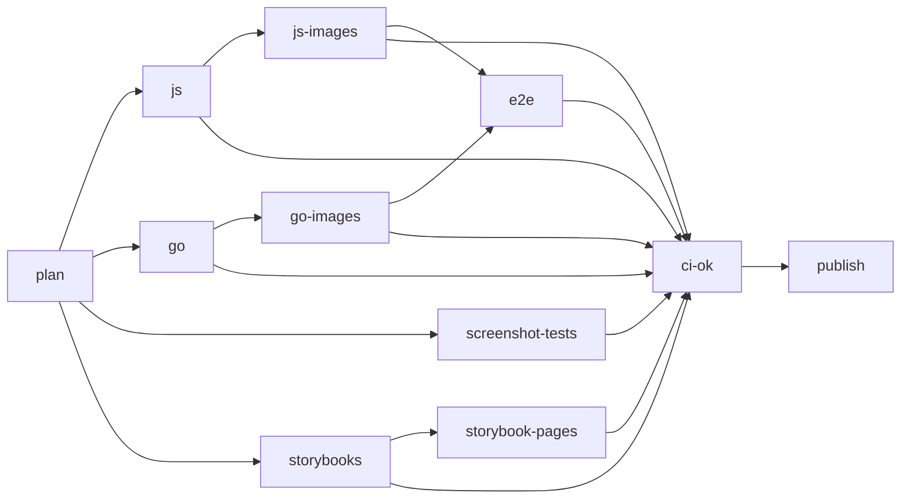

# APIHUB monorepo

All APIHUB components in one repository: the TypeScript libraries and applications, the Go services, the E2E suites,
and the deployment charts. One commit is one consistent state of the whole product, so a change that spans the backend,
a library, and the UI is one pull request.

> **Temporary names.** This repository is a prototype published under a personal account. The following names are
> placeholders for their `Netcracker` equivalents:
>
> - npm scope `@b41ex` (target: `@netcracker`), published to GitHub Packages
> - image registry `ghcr.io/b41ex/apihub-*`
> - repository `b41ex/monorepo-prototype`, and its Storybook site `https://b41ex.github.io/monorepo-prototype/`
> - the `image_owner` input of the E2E workflows

## Prerequisites

| Tool | Version | Source of truth |
| --- | --- | --- |
| Node.js | 24 | `.github/actions/setup-workspace/action.yml` |
| pnpm | 12.3.4 | `packageManager` in `package.json` |
| Go | 1.26.5 | `backend/.go-version` |
| Docker or podman | any | screenshot tests and images |

Install pnpm 12 directly (`npm i -g pnpm@12`, or `corepack enable`). pnpm 10 cannot switch itself to the pinned
version and fails with `Failed to switch pnpm to v12.3.4`, including for every script Nx starts.

On Windows, pnpm links are absolute junctions: a moved or copied checkout needs a fresh `pnpm install`.

## Repository layout

```text
frontend/            TypeScript components; api-doc-viewer, apispec-view and ui keep packages/*
backend/             Go modules: portal-backend, agent, agents-backend, api-linter-service, test-service, commons-go
tests/ui-tests/      Playwright E2E suite
tests/postman-collections/  Newman E2E collections
deploy/              docker-compose/ and helm-templates/
tools/ci/            scripts the workflows call
tools/release/       release guard
tools/nx/            local Nx plugin
.github/             workflows and the shared setup action
```

The workspace has 38 Nx projects: 32 pnpm packages and 6 Go modules. The project name is `nx.name` in a
`package.json`, or the directory name of a `go.mod`. There is no `project.json`.

## Tools

**pnpm workspaces.** `pnpm-workspace.yaml` lists the members. Internal dependencies use `workspace:^`, which links the
package from the tree; `pnpm publish` rewrites it to a real range such as `^2.9.5`. One lockfile, `pnpm-lock.yaml`,
covers the whole workspace. The linker is `isolated`, so each package resolves only what it declares:

- Declare every package you import, including binaries used in scripts (`rimraf`, `vite`, `webpack`).
- Use `pnpm run` and `pnpm exec` in scripts, never `npm run` or `npx`.

**Nx.** Nx reads the dependency graph from the manifests and runs tasks in topological order, in parallel. `build`,
`test` and `screenshot-test` depend on `^build`, so upstream packages build first. Results are cached by a hash of the
inputs, and an unchanged upstream is a cache restore. `nx affected` selects the projects changed since a base commit,
plus their dependents.

**Go workspaces.** `go.work` at the repository root includes all six modules, so a local `commons-go` change is seen
by every service. `@nx-go/nx-go` turns each `go.mod` into an Nx project, and `tools/nx/go-lang-tag.js` tags it
`lang:go`. Images build each module alone with `GOWORK=off`, so every `go.mod` must hold the versions the workspace
resolves. `go work sync` writes them.

## Everyday commands

Open the repository root in your editor, so gopls reads `go.work`. `pnpm nx` is short for `pnpm exec nx` and works
from any directory.

### Frontend developer

Run `pnpm install` once at the repository root. Then work from the package's directory. There, pnpm runs a script by
its name (`pnpm build` is `pnpm run build`), and Nx takes the project from the directory, so no command needs a
package name.

```bash
cd frontend/api-diff
```

| Task, in the package directory | pnpm | Nx |
| --- | --- | --- |
| Build, dependencies first | `pnpm -F "{.}..." build` | `pnpm nx build` |
| Build this package only | `pnpm build` | `pnpm nx build --exclude-task-dependencies` |
| Build, then everything that depends on it | `pnpm -F "...{.}..." build` | `pnpm nx affected -t build --files=<file>` |
| Test | `pnpm test` | `pnpm nx test` |
| Run the screenshot suite | `pnpm screenshot-test` | `pnpm nx screenshot-test` |
| Update screenshot baselines | `pnpm regenerate-screenshots` | `pnpm nx regenerate-screenshots` |
| Run any other script | `pnpm storybook` | `pnpm nx storybook` |

| Task, at the repository root | pnpm | Nx |
| --- | --- | --- |
| Build working tree changes | `pnpm -F "...[HEAD]..." -F "!{.}" build` | `pnpm nx affected -t build --uncommitted` |
| Build branch changes | `pnpm -F "...[develop]..." -F "!{.}" build` | `pnpm nx affected -t build --base=develop` |

Notes on these commands:

- `-F` is short for `--filter`. `{.}` is the current directory, a trailing `...` adds dependencies, a leading `...`
  adds dependents, and `[HEAD]` selects packages changed since that commit, uncommitted changes included.
- At the root, `!{.}` leaves out the root package, whose `build` script builds the whole workspace. Inside a package
  the same selector would leave out that package.
- `pnpm -r` covers the whole workspace from any directory. In a package, use `pnpm build`, not `pnpm -r build`.
- `--files` takes a path from the repository root, for example `frontend/api-diff/package.json`.
- With pnpm, `pnpm test` needs the dependencies built; run `pnpm -F "{.}..." build` first.
- Scripts differ between packages. `pnpm run` with no arguments lists the current package's scripts.

The screenshot suites are in `frontend/class-view`, `frontend/api-doc-viewer/packages/api-doc-viewer` and
`frontend/apispec-view/packages/elements`. Chrome runs in a container; set `DOCKER_BINARY=podman` if you use podman.
Commit the PNGs that `regenerate-screenshots` changes.

> **pnpm or Nx.** Both run the package's own `package.json` scripts, in dependency order, so the output is the same.
> The differences:
>
> - **Dependencies.** pnpm runs exactly the packages the filter selects. A package whose dependencies have no `dist`
>   fails to build, so add `...` to the filter. Nx builds the dependencies of `build`, `test` and `screenshot-test`
>   itself.
> - **Cache.** pnpm reruns every selected script every time, so building a package with its dependencies rebuilds all
>   of them. Nx restores unchanged tasks from its cache, and a second run takes seconds.
> - **Selection.** Both select the packages whose files changed, plus the dependents you ask for. Nx is what CI runs,
>   so `nx affected` locally selects the projects CI would select for the same base.
> - **Scope.** `regenerate-screenshots` and other scripts without a task default in `nx.json` do not build
>   dependencies under either tool. Build the package first.
>
> Use pnpm for a quick script in a package whose dependencies are already built. Use Nx for anything that crosses
> packages.

Build the `ui` image locally, with either tool:

```bash
pnpm -F "{frontend/ui/packages/portal}..." -F "{frontend/ui/packages/agents}..." build
```

```bash
pnpm nx run-many -t build --projects=ui-portal,ui-agents
```

```bash
cd frontend/ui && podman build -f Dockerfile.local .
```

`build-task-consumer` also needs a deploy tree first; see `frontend/build-task-consumer/README.md`. `pnpm deploy` fails
with `EPERM` on Windows, so build that image in CI or WSL.

### Backend developer

Go alone is enough. `pnpm install` is needed only for Nx.

```bash
cd backend/portal-backend && go build && go test ./...
```

`./...` does not work from the root, which is not a module. Each service needs its own runtime setup, described in the
component's docs, for example `backend/portal-backend/docs/local_development/local_development.md`.

With Nx, for caching and dependents:

```bash
pnpm nx run-many -t build test --projects=tag:lang:go
```

```bash
pnpm nx affected -t build test --files=backend/commons-go/go.mod
```

Binaries go to `dist/backend/<component>`. Build a module exactly as its image does:

```bash
cd backend/portal-backend && GOWORK=off GOFLAGS=-mod=readonly go build ./...
```

After changing a Go dependency, sync, check, and commit every changed `go.mod` and `go.sum`:

```bash
go work sync && bash tools/ci/go-work-sync-check.sh
```

Build an image. Services that import `commons-go` use `backend/` as the context; `agent` and `test-service` use their
own directory.

```bash
podman build -f backend/portal-backend/Dockerfile backend
```

```bash
podman build -f backend/agent/Dockerfile backend/agent
```

### Both

```bash
pnpm nx graph
```

```bash
pnpm nx show project portal-backend --json
```

A repeated build should report `Cache: N/N hit (100%)`. If it does not, a shared input changed; see
[Gotchas](#gotchas).

## Configuration files

| File | What it controls |
| --- | --- |
| `package.json` | pnpm version pin, and the workspace-wide tools (`nx`, `@nx/js`, `@nx-go/nx-go`, `typescript`) |
| `pnpm-workspace.yaml` | members, linker, `overrides`, `allowBuilds`, deploy settings |
| `pnpm-lock.yaml` | resolved versions for every package; one file for the workspace |
| `.npmrc` | registry and auth only; pnpm 12 ignores other settings here without a warning |
| `nx.json` | task defaults and inputs, cache location, Go plugin, release configuration |
| `go.work`, `go.work.sum` | Go workspace modules and their checksums |
| `backend/.go-version` | the one Go version; CI checks every `go.mod` and Dockerfile against it |
| `.dockerignore` | opt-in list of what the frontend images may copy; update it with every new `COPY` |
| `backend/.dockerignore` | build context filter for the backend images |
| `.github/actions/setup-workspace` | Node, pnpm, install, and both caches, shared by every job |
| `tools/ci/storybooks.json` | the components whose Storybooks CI publishes |
| `tools/release/guard.js` | refuses a real release outside `main` |

Rules that are easy to miss:

- **Overrides** apply only from `pnpm-workspace.yaml`. An `overrides` block in any `package.json` is ignored.
- **Build scripts** of dependencies are denied by name in `allowBuilds`. A new dependency with an install script fails
  `pnpm install` until it is added there.
- **`sharedGlobals`** in `nx.json` (`pnpm-lock.yaml`, `pnpm-workspace.yaml`, `.npmrc`, `nx.json`) are inputs of every
  project. Changing one rebuilds and retests everything.

## CI

All workflows are in `.github/workflows/`.

| Workflow | Runs on | Does |
| --- | --- | --- |
| `ci.yml` | push to any branch, pull request, dispatch | build, test, images, E2E, Storybooks, publish |
| `images.yml` | called by `ci.yml` | build or retag Docker images |
| `e2e-tests-kind.yml` | called by `ci.yml` | E2E on Kind from the Helm charts |
| `e2e-tests-compose.yml` | called by `e2e-tests-manual.yml` | E2E under podman compose |
| `e2e-tests-manual.yml` | dispatch, push to `e2e-manual/**` | E2E against images you choose |
| `pages.yml` | dispatch, branch deletion, daily | assemble and deploy the Storybook site |
| `release-finish.yml` | dispatch | version, tag, and release |

### The `ci.yml` pipeline



| Job | What it does |
| --- | --- |
| `plan` | computes the affected set once and passes it to the other jobs |
| `js` | `nx affected -t build test` for the TypeScript projects, in one job |
| `go` | version and `go.work` sync checks, then build and test the affected Go modules |
| `screenshot-tests` | one leg per affected suite; uploads the diff PNGs when a suite fails |
| `js-images`, `go-images` | the seven images, gated on the tests of their language |
| `e2e` | the product on Kind, then Newman and Playwright; pull requests only |
| `storybooks`, `storybook-pages` | Storybooks for six components; not run for pull requests |
| `ci-ok` | the only required check: fails if any job failed or was cancelled, and a skipped job passes |
| `publish` | on `main` only, `pnpm publish -r` |

`nx-set-shas` sets the base: the merge base for a pull request, and the last successful `develop` run for a push.
Screenshot suites do not wait for `js`; each builds its own dependencies.

### Frontend: screenshot tests and Storybook

- **Screenshot tests** cover `api-doc-viewer` (947 tests), `apispec-view` (883), and `class-view` (58). Each builds
  its Storybook, serves it, and compares Chrome screenshots in `ghcr.io/netcracker/qubership-apihub-nodejs-dev-image`,
  pinned by digest. The target is cached, so an unchanged suite is replayed rather than rerun.
- **Storybooks** of `api-doc-viewer`, `apispec-view`, `class-view`, `graphapi`, `rest-playground` and `ui` are
  published on every push. A build is stored in ghcr as `storybook-<component>`, and the branch gets a pointer to it.
  `pages.yml` assembles the site at `<component>/<branch>/`, with `/` in a branch name replaced by `-`. It removes a
  branch's folder when the branch is deleted, and a daily run catches any deletion it missed. The Storybook of a red
  branch is still published.

### Caching

| Cache | Key | Effect |
| --- | --- | --- |
| pnpm store | lockfile hash, falls back to the latest store | a warm install takes about 20 seconds |
| Nx computation cache (`.nx`, `~/.nx`) | branch and job, falls back to `develop` | unchanged tasks are restored |
| image tag `src-<hash>` | the image's projects and dependencies, Dockerfile, ignore files | retag instead of rebuild |
| buildx layer cache | image name | unchanged layers are reused |
| Storybook `in-<hash>` and `out-<hash>` | build inputs and output files | an unchanged Storybook is not rebuilt |

Each job ends with a cache summary. Trust Nx's `Cache: N/N hit` line in it, not a "Cache restored" message. A feature
branch compares against `develop`, so every push to it rebuilds whatever the branch has changed so far.

### Images

| Image | Built from |
| --- | --- |
| `apihub-ui` | `ui-portal` and `ui-agents` build output |
| `apihub-build-task-consumer` | build output plus a `pnpm deploy --prod` tree |
| `apihub-portal-backend` | Go source, compiled in the image |
| `apihub-agent`, `apihub-agents-backend` | Go source, compiled in the image |
| `apihub-api-linter-service`, `apihub-test-service` | Go source, compiled in the image |

Every image job runs on every push, whatever `affected` says. If `src-<hash>` already exists in the registry, the job
only points the branch tag at it, which takes seconds. Branch tags: `develop` → `dev`, `release` → `next`,
`main` → `latest`, `feature/x` → `feature-x`. Images are `linux/amd64` only. The commit and branch are OCI
annotations on the branch tag; read them with `docker buildx imagetools inspect <image>:<tag>`.

### E2E tests

`e2e-tests-kind.yml` creates a Kind cluster, installs `deploy/helm-templates` and the agent chart with this run's
images, and runs the Newman collections from `tests/postman-collections` and the Playwright `Portal` project from
`tests/ui-tests`. It runs the full suite for pull requests; a push without an open pull request runs no E2E. Reports
and cluster logs are uploaded as artifacts.

To run E2E against specific images, dispatch `e2e-tests-manual.yml`. Pick `kind` or `podman-compose`, and pass
`src-<hash>` tags to pin exact content. Clear `repoint_images` to run against upstream `:dev` images as a baseline.

### Release process

Components are released together, from one `release` branch, and each keeps its own version. Nx derives each bump from
[Conventional Commits](https://www.conventionalcommits.org/) since the component's last tag, so commit messages decide
versions.

1. **Start.** Cut the branch and push it. CI publishes `:next` images.

   ```bash
   git switch -c release develop && git push -u origin release
   ```

2. **Stabilize.** Merge fixes into `release`. No version changes happen on this branch.
3. **Finish.** Dispatch `release-finish.yml` with `dry_run` checked, read the plan in the job summary, then dispatch it
   again with `dry_run` cleared. The workflow:
   - fast-forwards `main` to `release`;
   - runs `nx release --skip-publish`, which versions changed components and their dependents, commits, pushes tags
     named `<project>/<version>`, and creates a GitHub Release per component;
   - starts CI on `main`, which builds `:latest` images and publishes the npm packages with `pnpm publish -r`;
   - merges `main` back into `develop` and starts CI there.

What is published is decided only by `"private": true` in each `package.json`. Applications, test suites and internal
packages are private; 14 libraries are published. Always publish with pnpm: `npm publish` ships `workspace:^`
unchanged, and the package cannot be installed. Release notes are GitHub Releases, not `CHANGELOG.md` files.

## Known gaps

- **Lint does not run in CI.** The `js` job runs `build` and `test` only, and several components have unfixed lint
  errors.
- **Pushes without a pull request run no E2E.** The smoke tier is commented out in `ci.yml`.
- **Commit messages are not validated,** although release versions depend on them.
- **Hotfixes have no workflow.** The intended flow is the release flow, branched from `main`.
- **Multi-arch images are not built.** `release` and `main` are `linux/amd64` only.
- **The `build-task-consumer` Dockerfile is not self-contained.** It needs the build output and a deploy tree from the
  host.

## Gotchas

- `CI=true` makes `pnpm install` default to `--frozen-lockfile`; pass `--no-frozen-lockfile` after editing a manifest.
- Editing `.gitignore` invalidates the Nx cache for every project, because Nx uses it to list project files.
- `--projects` takes a comma-separated list. A space-separated one matches nothing and exits 0.
- Do not pass runner flags through `pnpm -r`: in `pnpm -r test -- --no-cache`, jest reads `--no-cache` as a test name
  pattern.
- `pnpm --filter` takes a package name or a path, never an Nx project name.
- After several quickly cancelled pushes, the next run compares against an older base and selects more projects.

## Where the component repositories went

| Repository | Location |
| --- | --- |
| `qubership-apihub-backend` | `backend/portal-backend` |
| `qubership-apihub-agent` | `backend/agent` |
| `qubership-apihub-agents-backend` | `backend/agents-backend` |
| `qubership-api-linter-service` | `backend/api-linter-service` |
| `qubership-apihub-test-service` | `backend/test-service` |
| `qubership-apihub-commons-go` | `backend/commons-go` |
| `qubership-apihub-json-crawl` | `frontend/json-crawl` |
| `qubership-apihub-graphapi` | `frontend/graphapi` |
| `qubership-apihub-ddlapi` | `frontend/ddlapi` |
| `qubership-apihub-http-spec` | `frontend/http-spec` |
| `qubership-apihub-compatibility-suites` | `frontend/compatibility-suites` |
| `qubership-apihub-api-unifier` | `frontend/api-unifier` |
| `qubership-apihub-api-diff` | `frontend/api-diff` |
| `qubership-apihub-api-visitor` | `frontend/api-visitor` |
| `qubership-apihub-api-processor` | `frontend/api-processor` |
| `qubership-apihub-api-doc-viewer` | `frontend/api-doc-viewer` |
| `qubership-apihub-apispec-view` | `frontend/apispec-view` |
| `qubership-apihub-class-view` | `frontend/class-view` |
| `qubership-apihub-rest-playground` | `frontend/rest-playground` |
| `qubership-apihub-ui` | `frontend/ui` |
| `qubership-apihub-build-task-consumer` | `frontend/build-task-consumer` |
| `qubership-apihub-vscode` | stays a separate repository |
| `qubership-apihub-ui-tests` | `tests/ui-tests` |
| `qubership-apihub-postman-collections` | `tests/postman-collections` |
| `qubership-apihub-jest-chrome-in-docker-environment` | `tools/jest-chrome-in-docker-environment` |
| `qubership-apihub` | `deploy` |
| `qubership-apihub-ci` | `.github/workflows` |
| `qubership-apihub-npm-gitflow` | replaced by `nx release` and `release-finish.yml` |
| `qubership-apihub-nodejs-dev-image` | stays separate; the screenshot suites pull its image |
