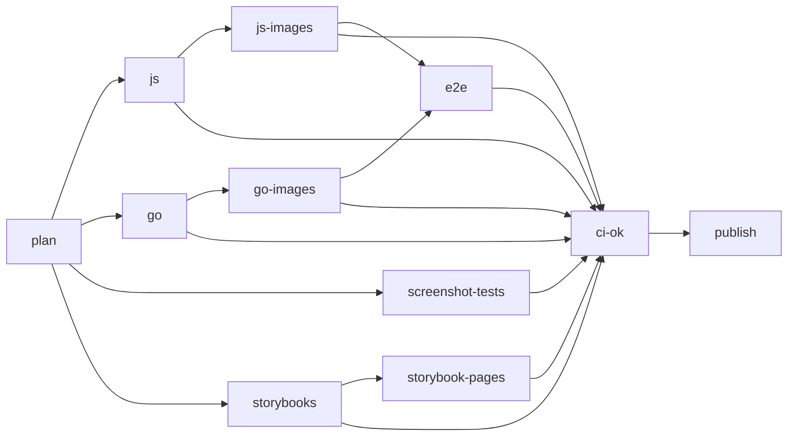

# APIHUB monorepo

All APIHUB components in one repository: the TypeScript libraries and applications, the Go services, the E2E suites,
and the deployment charts. One commit is one consistent state of the whole product, so a change that spans the backend,
a library, and the UI is one pull request.

> **Temporary names.** This repository is a prototype published under a personal account. The following names are
> placeholders for their `Netcracker` equivalents:
>
> - npm scope `@b41ex` (target: `@netcracker`), published to GitHub Packages
> - image registry `ghcr.io/b41ex/apihub-*`
> - repository `b41ex/monorepo-prototype`, and its Storybook site `https://b41ex.github.io/monorepo-prototype/`
> - the `image_owner` input of the E2E workflows

## Prerequisites

| Tool | Version | Source of truth |
| --- | --- | --- |
| Node.js | 24 | `.github/actions/setup-workspace/action.yml` |
| pnpm | 12.4.2 | `packageManager` in `package.json` |
| Go | 1.26.5 | `backend/.go-version` |
| Docker or podman | any | screenshot tests and images |

Install pnpm 12 directly (`npm i -g pnpm@12`, or `corepack enable`).

## Repository layout

```text
frontend/            TypeScript components; api-doc-viewer, apispec-view and ui keep packages/*
backend/             Go modules: portal-backend, agent, agents-backend, api-linter-service, test-service, commons-go
tests/ui-tests/      Playwright E2E suite
tests/postman-collections/  Newman E2E collections
deploy/              docker-compose/ and helm-templates/; the agent chart is in backend/agent/helm-templates/
tools/ci/            scripts the workflows call
tools/release/       release guard
tools/nx/            local Nx plugin
tools/jest-chrome-in-docker-environment/  published jest environment for the screenshot suites
.github/             workflows and the shared setup action
```

The workspace has 38 Nx projects: 32 pnpm packages and 6 Go modules. There is no `project.json`. A Go project is named
after its directory. A pnpm project is named by `nx.name` in its `package.json`, which differs from both the package
name and the directory:

| Directory | Nx project | Package |
| --- | --- | --- |
| `frontend/api-diff` | `api-diff` | `@b41ex/qubership-apihub-api-diff` |
| `frontend/apispec-view` | `apispec-view-root` | `@b41ex/qubership-apihub-apispec-view-workspace` |
| `frontend/apispec-view/packages/elements` | `apispec-view` | `@b41ex/qubership-apihub-apispec-view` |
| `frontend/ui/packages/portal` | `ui-portal` | `@b41ex/qubership-apihub-ui-portal` |

Nx commands take the project name; `pnpm --filter` takes the package name or a path. To look names up:

```bash
pnpm nx show projects                  # every project name
pnpm nx show project ui-portal --json  # root, targets, and tags of one project
pnpm nx graph                          # the dependency graph in a browser
```

## Tools

**pnpm workspaces.** `pnpm-workspace.yaml` lists the members. Internal dependencies use `workspace:^`, which links the
package from the tree; `pnpm publish` rewrites it to a real range such as `^2.9.5`. Packages inside one component, such
as `api-doc-viewer/packages/*`, use `workspace:*`, which is published as the exact version. One lockfile,
`pnpm-lock.yaml`, covers the whole workspace. Packages are stored once per machine in a content-addressable store, so
another worktree links them instead of downloading them again. The linker is `isolated`, so each package resolves only
what it declares:

- Declare every package you import, including binaries used in scripts (`rimraf`, `vite`, `webpack`).
- Use `pnpm run` and `pnpm exec` in scripts, never `npm run` or `npx`.

**Nx.** Nx reads the dependency graph from the manifests and runs tasks in topological order, in parallel. `build`,
`test` and `screenshot-test` depend on `^build`, so upstream packages build first. Results are cached by a hash of the
inputs, and an unchanged upstream is a cache restore. The cache is in `~/.nx/<id>/` and every worktree of the
repository shares it; setting `cacheDirectory` or `NX_CACHE_DIRECTORY` turns that sharing off. `nx affected` selects
the projects changed since a base commit, plus their dependents.

**Go workspaces.** `go.work` at the repository root includes all six modules, so a local `commons-go` change is seen
by every service. `@nx-go/nx-go` turns each `go.mod` into an Nx project, and `tools/nx/go-lang-tag.js` tags it
`lang:go`. Images build each module alone with `GOWORK=off`, so every `go.mod` must hold the versions the workspace
resolves. `go work sync` writes them.

## Development workflow

Times below were measured on one Windows workstation and vary with the machine and the connection.

### Worktrees

Use one Git worktree per branch. Worktrees share one `.git`, one pnpm store, and one Nx cache, and each has its own
`node_modules`, so two branches never see each other's links. A layout that works:

```text
apihub/
  _develop.repo/    the clone
  my-feature/       one folder per worktree
```

Create a worktree (11 s):

```bash
git worktree add ../my-feature -b feature/my-feature develop
```

Remove it (about 2 min). On Windows, `git worktree remove` can fail with `Directory not empty`; delete the directory
by hand.

```bash
git worktree remove ../my-feature
git branch -d feature/my-feature
```

### Frontend

Install from anywhere in the worktree; `pnpm install` always installs the whole workspace. A cold install on a new
machine downloads every package (10 min). Later installs link from the store (3.5 min locally, about 20 s in CI). On
Windows, pnpm links are absolute junctions: a moved or copied checkout needs a fresh `pnpm install`.

```bash
pnpm install
```

Build everything (7 min):

```bash
pnpm nx run-many -t build
```

Build one project and everything it depends on, from any folder:

```bash
pnpm nx build ui-portal
```

Build several projects:

```bash
pnpm nx run-many -t build -p ui-portal,ui-agents
```

Build the project in the current folder, for example `frontend/api-processor`:

```bash
pnpm nx build
```

Run tests for every project, for several projects, and build and test every frontend project:

```bash
pnpm nx run-many -t test
pnpm nx run-many -t test -p api-unifier,api-diff
pnpm nx run-many -t build,test -p 'directory:frontend/**'
```

#### Changes across components

`npm link` is not needed. `test` depends on `^build`, so this command rebuilds any changed upstream component, such as
`api-diff`, before it tests `api-processor`:

```bash
pnpm nx test api-processor
```

Rebuild `api-processor` whenever it or one of its dependencies changes:

```bash
pnpm nx watch -p api-processor --includeDependencies -- pnpm nx build api-processor
```

#### Build and test everything a change affects

`nx run-many` builds a project and its dependencies, not its dependents. To also build and test every project
downstream of your change, as CI does, use `affected`:

```bash
pnpm nx affected -t build test --base=develop   # everything changed on this branch
pnpm nx affected -t build test --uncommitted    # only uncommitted changes
pnpm nx show projects --affected --base=develop # list the selection without running it
```

#### Adding a dependency

Add a third-party package to one project, from anywhere in the worktree:

```bash
pnpm add lodash --filter @b41ex/qubership-apihub-api-diff
```

Add an internal package with `--workspace`, which writes `workspace:^`:

```bash
pnpm add @b41ex/qubership-apihub-api-unifier --workspace --filter @b41ex/qubership-apihub-api-diff
```

Nx builds its graph from `package.json` only. A dependency that exists only as a tsconfig `paths` entry, a bundler
alias, or a jest `moduleNameMapper` is invisible to Nx, so it can build in the wrong order and `affected` misses it.
Declare it in `package.json` as well. A new dependency with an install script fails `pnpm install` until it is listed
in `allowBuilds` in `pnpm-workspace.yaml`.

#### IDE

Library types come from the upstream `dist/`, so they change only after a rebuild. Go to definition lands in the
upstream source for the libraries that emit declaration maps: `api-diff`, `api-unifier`, `api-visitor`,
`compatibility-suites`, `ddlapi`, `graphapi`, and `json-crawl`. For the others it lands in `dist/*.d.ts`. The debugger
steps into upstream source wherever the build emits source maps; `class-view` and
`jest-chrome-in-docker-environment` emit none.

### Backend

Go 1.26.5 is enough for everyday work. Open the repository root in the editor, so gopls reads `go.work` and sees all
six modules.

Build and test a service, from its directory, for example `backend/portal-backend`:

```bash
go build
go test ./...
```

`go build` leaves the binary in the directory. `./...` fails from the repository root, because the root holds `go.work`
but is not a module.

Build a module alone, the way its image does. If this fails while the workspace build passes, its `go.mod` has drifted
from the workspace:

```bash
GOWORK=off GOFLAGS=-mod=readonly go build ./...
```

After changing a dependency, write the workspace versions back into every `go.mod`, check them as CI does, and commit
every `go.mod` and `go.sum` that changed:

```bash
go work sync
bash tools/ci/go-work-sync-check.sh
```

Build an image. The three services that import `commons-go` build from `backend/`; `agent` and `test-service` build
from their own directory. Run from the repository root:

```bash
podman build -f backend/portal-backend/Dockerfile backend   # also agents-backend, api-linter-service
podman build -f backend/agent/Dockerfile backend/agent      # also test-service
```

A running service needs a `config.yaml` made from `config.template.yaml` in its directory, and `portal-backend` and
`api-linter-service` also need a database. See `backend/portal-backend/docs/local_development/local_development.md`.

#### Through Nx

Nx adds the task cache and `affected`. It needs pnpm and a `pnpm install` in the worktree. Binaries go to
`dist/backend/<name>`, with `.exe` on Windows. `commons-go` is a library and has no `build` target.

```bash
pnpm nx run-many -t build,test -p tag:lang:go
pnpm nx affected -t build test --base=develop --exclude='!tag:lang:go'
pnpm nx run portal-backend:serve
```

## Configuration files

| File | What it controls |
| --- | --- |
| `package.json` | pnpm version pin, and the workspace-wide tools (`nx`, `@nx/js`, `@nx-go/nx-go`, `typescript`) |
| `pnpm-workspace.yaml` | members, linker, `overrides`, `allowBuilds`, `pnpm deploy` and `pnpm run` behavior |
| `pnpm-lock.yaml` | resolved versions for every package; one file for the workspace |
| `.npmrc` | registry and auth only; pnpm 12 ignores other settings here without a warning |
| `nx.json` | task defaults and inputs, Go plugin, release configuration |
| `go.work`, `go.work.sum` | Go workspace modules and their checksums |
| `backend/.go-version` | the one Go version; CI checks every `go.mod` and Dockerfile against it |
| `.dockerignore` | opt-in list of what the frontend images may copy; update it with every new `COPY` |
| `backend/.dockerignore`, `backend/*/.dockerignore` | build context filters for the backend images |
| `.github/actions/setup-workspace` | Node, pnpm, install, and both caches, shared by every job |
| `tools/ci/storybooks.json` | the components whose Storybooks CI publishes |
| `tools/release/guard.js` | refuses a real release outside `main` |

Rules that are easy to miss:

- **Overrides** apply only from `pnpm-workspace.yaml`. An `overrides` block in any `package.json` is ignored.
- **Build scripts** of dependencies are denied by name in `allowBuilds`. A new dependency with an install script fails
  `pnpm install` until it is added there.
- **`sharedGlobals`** in `nx.json` (`pnpm-lock.yaml`, `pnpm-workspace.yaml`, `.npmrc`, `nx.json`) are inputs of every
  project. Changing one rebuilds and retests everything.

## CI

All workflows are in `.github/workflows/`.

| Workflow | Runs on | Does |
| --- | --- | --- |
| `ci.yml` | push to any branch, pull request, dispatch | build, test, images, E2E, Storybooks, publish |
| `images.yml` | called by `ci.yml` | build or retag Docker images |
| `e2e-tests-kind.yml` | called by `ci.yml` | E2E on Kind from the Helm charts |
| `e2e-tests-compose.yml` | called by `e2e-tests-manual.yml` | E2E under podman compose |
| `e2e-tests-manual.yml` | dispatch, push to `e2e-manual/**` | E2E against images you choose |
| `pages.yml` | dispatch, branch deletion, daily | assemble and deploy the Storybook site |
| `release-finish.yml` | dispatch | version, tag, and release |

A pull request that changes only Markdown files or `docs/**` does not start `ci.yml`.

### The `ci.yml` pipeline



| Job | What it does |
| --- | --- |
| `plan` | computes the affected set once and passes it to the other jobs |
| `js` | `nx affected -t build test` for the TypeScript projects, in one job |
| `go` | version and `go.work` sync checks, then build and test the affected Go modules |
| `screenshot-tests` | one leg per affected suite; uploads the diff PNGs when a suite fails |
| `js-images`, `go-images` | the seven images, gated on the tests of their language |
| `e2e` | the product on Kind, then Newman and Playwright; pull requests only |
| `storybooks`, `storybook-pages` | Storybooks for six components; not run for pull requests |
| `ci-ok` | the only required check: fails if any job failed or was cancelled, and a skipped job passes |
| `publish` | on `main` only, `pnpm publish -r` |

`nx-set-shas` sets the base: the merge base for a pull request, and the last successful `develop` run for a push.
Screenshot suites do not wait for `js`; each builds its own dependencies.

### Frontend: screenshot tests and Storybook

- **Screenshot tests** cover `api-doc-viewer`, `apispec-view`, and `class-view`. Each builds its Storybook, serves
  it, and compares Chrome screenshots in `ghcr.io/netcracker/qubership-apihub-nodejs-dev-image`, pinned by digest.
  The target is cached, so an unchanged suite is replayed rather than rerun.
- **Storybooks** of `api-doc-viewer`, `apispec-view`, `class-view`, `graphapi`, `rest-playground` and `ui` are
  published on every push. A build is stored in ghcr as `storybook-<component>`, and the branch gets a pointer to it.
  `pages.yml` assembles the site at `<component>/<branch>/`. In the branch name, every character other than letters,
  digits, `.`, `_`, and `-` is replaced by `-`. It removes a branch's folder when the branch is deleted, and a daily run
  catches any deletion it missed. The Storybook of a red branch is still published.

### Caching

| Cache | Key | Effect |
| --- | --- | --- |
| pnpm store | lockfile hash, falls back to the latest store | a warm install takes about 20 seconds |
| Nx computation cache (`.nx`, `~/.nx`) | branch and job, falls back to `develop` | unchanged tasks are restored |
| image tag `src-<hash>` | the image's projects and dependencies, Dockerfile, ignore files | retag instead of rebuild |
| buildx layer cache | image name | unchanged layers are reused |
| Storybook `in-<hash>` and `out-<hash>` | build inputs and output files | an unchanged Storybook is not rebuilt |

Each job ends with a cache summary. Trust Nx's `Cache: N/N hit` line in it, not a "Cache restored" message. A feature
branch compares against `develop`, so every push to it rebuilds whatever the branch has changed so far.

### Images

| Image | Built from |
| --- | --- |
| `apihub-ui` | `ui-portal` and `ui-agents` build output |
| `apihub-build-task-consumer` | build output plus a `pnpm deploy --prod` tree |
| `apihub-portal-backend` | Go source, compiled in the image |
| `apihub-agent`, `apihub-agents-backend` | Go source, compiled in the image |
| `apihub-api-linter-service`, `apihub-test-service` | Go source, compiled in the image |

Every image job runs on every push, whatever `affected` says. If `src-<hash>` already exists in the registry, the job
only points the branch tag at it, which takes seconds. Branch tags: `develop` → `dev`, `release` → `next`,
`main` → `latest`, `feature/x` → `feature-x`, pull request `N` → `pull-N-merge`. Images are `linux/amd64` only. The
commit and branch are OCI annotations on the branch tag; read them with
`docker buildx imagetools inspect <image>:<tag>`.

### E2E tests

`e2e-tests-kind.yml` creates a Kind cluster, installs `deploy/helm-templates` and the agent chart with this run's
images, and runs the Newman collections from `tests/postman-collections` and the Playwright `Portal` project from
`tests/ui-tests`. It runs the full suite for pull requests; a push without an open pull request runs no E2E. Reports
and cluster logs are uploaded as artifacts.

To run E2E against specific images, dispatch `e2e-tests-manual.yml`. Pick `kind` or `podman-compose`, and pass
`src-<hash>` tags to pin exact content. Clear `repoint_images` to run against upstream `:dev` images as a baseline.

### Release process

⚠️ Verified for the frontend libraries only.

Components are released together, from one `release` branch, and each keeps its own version. Nx derives each bump from
[Conventional Commits](https://www.conventionalcommits.org/) since the component's last tag, so commit messages decide
versions.

1. **Start.** Cut the branch and push it. CI publishes `:next` images. `-C` resets the `release` branch left by the
   previous release; `develop` already contains it after the back-merge, so the push is a fast-forward.

   ```bash
   git switch -C release develop && git push -u origin release
   ```

2. **Stabilize.** Merge fixes into `release`. No version changes happen on this branch.
3. **Finish.** Dispatch `release-finish.yml` with `dry_run` checked, read the plan in the job summary, then dispatch it
   again with `dry_run` cleared. The workflow:
   - fast-forwards `main` to `release`;
   - runs `nx release --skip-publish`, which versions changed components and their dependents, commits, pushes tags
     named `<project>/<version>`, and creates a GitHub Release per component;
   - starts CI on `main`, which builds `:latest` images and publishes the npm packages with `pnpm publish -r`;
   - merges `main` back into `develop` and starts CI there.

What is published is decided only by `"private": true` in each `package.json`. Applications, test suites and internal
packages are private; 14 libraries are published. Always publish with pnpm: `npm publish` ships `workspace:^`
unchanged, and the package cannot be installed. Release notes are GitHub Releases, not `CHANGELOG.md` files.

## Known gaps

- **Lint does not run in CI.** The `js` job runs `build` and `test` only, and several components have unfixed lint
  errors.
- **Pushes without a pull request run no E2E.** The smoke tier is commented out in `ci.yml`.
- **Commit messages are not validated,** although release versions depend on them.
- **Hotfixes have no workflow.** The intended flow is the release flow, branched from `main`.
- **Multi-arch images are not built.** `release` and `main` are `linux/amd64` only.
- **The `build-task-consumer` Dockerfile is not self-contained.** It needs the build output and a deploy tree from the
  host.

## Gotchas

- `pnpm run` and `pnpm exec` never install first (`verifyDepsBeforeRun: false`). Run `pnpm install` yourself after
  editing a manifest.
- `CI=true` makes `pnpm install` default to `--frozen-lockfile`; pass `--no-frozen-lockfile` after editing a manifest.
- Editing `.gitignore` invalidates the Nx cache for every project, because Nx uses it to list project files.
- `--projects` takes a comma-separated list. A space-separated one matches nothing and exits 0.
- Do not pass runner flags through `pnpm -r`: in `pnpm -r test -- --no-cache`, jest reads `--no-cache` as a test name
  pattern.
- `pnpm --filter` takes a package name or a path, never an Nx project name.
- After several quickly cancelled pushes, the next run compares against an older base and selects more projects.

## Where the component repositories went

| Repository | Location |
| --- | --- |
| `qubership-apihub-backend` | `backend/portal-backend` |
| `qubership-apihub-agent` | `backend/agent` |
| `qubership-apihub-agents-backend` | `backend/agents-backend` |
| `qubership-api-linter-service` | `backend/api-linter-service` |
| `qubership-apihub-test-service` | `backend/test-service` |
| `qubership-apihub-commons-go` | `backend/commons-go` |
| `qubership-apihub-json-crawl` | `frontend/json-crawl` |
| `qubership-apihub-graphapi` | `frontend/graphapi` |
| `qubership-apihub-ddlapi` | `frontend/ddlapi` |
| `qubership-apihub-http-spec` | `frontend/http-spec` |
| `qubership-apihub-compatibility-suites` | `frontend/compatibility-suites` |
| `qubership-apihub-api-unifier` | `frontend/api-unifier` |
| `qubership-apihub-api-diff` | `frontend/api-diff` |
| `qubership-apihub-api-visitor` | `frontend/api-visitor` |
| `qubership-apihub-api-processor` | `frontend/api-processor` |
| `qubership-apihub-api-doc-viewer` | `frontend/api-doc-viewer` |
| `qubership-apihub-apispec-view` | `frontend/apispec-view` |
| `qubership-apihub-class-view` | `frontend/class-view` |
| `qubership-apihub-rest-playground` | `frontend/rest-playground` |
| `qubership-apihub-ui` | `frontend/ui` |
| `qubership-apihub-build-task-consumer` | `frontend/build-task-consumer` |
| `qubership-apihub-vscode` | stays a separate repository |
| `qubership-apihub-ui-tests` | `tests/ui-tests` |
| `qubership-apihub-postman-collections` | `tests/postman-collections` |
| `qubership-apihub-jest-chrome-in-docker-environment` | `tools/jest-chrome-in-docker-environment` |
| `qubership-apihub` | `deploy` |
| `qubership-apihub-ci` | `.github/workflows` |
| `qubership-apihub-npm-gitflow` | replaced by `nx release` and `release-finish.yml` |
| `qubership-apihub-nodejs-dev-image` | stays separate; the screenshot suites pull its image |
