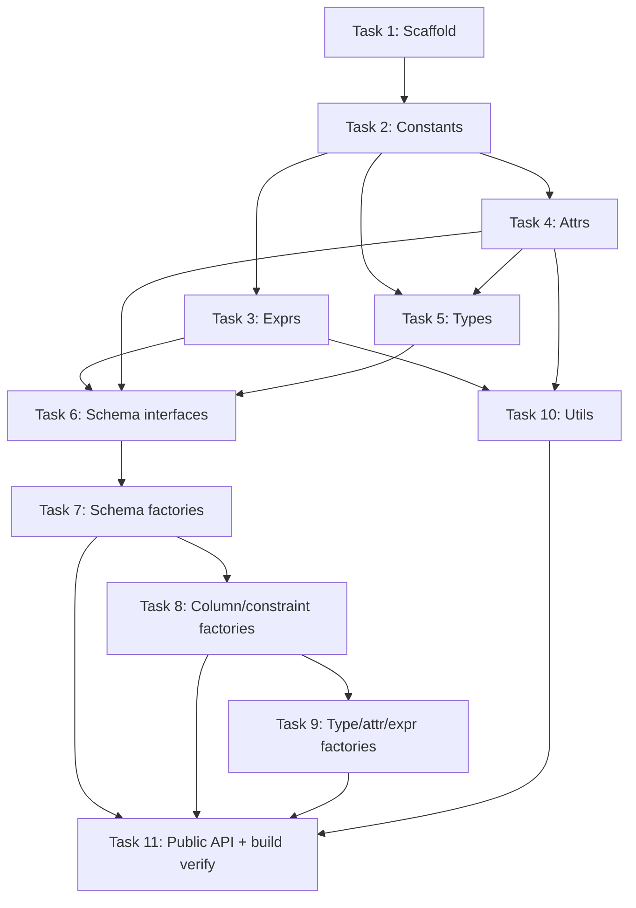

# TypeScript Port of Atlas Schema Model — Implementation Plan

## Goal

Port the core Atlas Go schema model (`atlas/sql/schema/schema.go`) to an idiomatic TypeScript
library. **Phase 1** covers only the bare data model — no HCL/SQL parsing, no serialization,
no driver-specific types.

## Package

| | |
|---|---|
| **Name** | `@netcracker/qubership-apihub-ddlapi` |
| **Location** | `https://github.com/Netcracker/qubership-apihub-ddlapi` |
| **Output** | Dual CJS + ESM, TypeScript declarations |
| **Tooling** | Vite 4 + vite-plugin-dts, ts-jest, TypeScript 5.x |

---

## Design Decisions

### 1. Discriminated Unions (no marker interfaces)

Go uses empty marker methods (`obj()`, `typ()`, `expr()`, `attr()`) to create nominal groups.
TypeScript ports these as **discriminated unions** — each concrete type carries a `kind` string
literal field.

```typescript
// All column type variants share the SchemaType union
type SchemaType = BoolType | IntegerType | StringType | EnumType | ...

// Exhaustive switch — compiler enforces all branches
switch (col.type.kind) {
  case 'BoolType':    ...
  case 'IntegerType': ...
}
```

Benefits: exhaustive dispatch, IntelliSense narrowing, zero runtime cost.

### 2. Plain Readonly Interfaces + Factory Functions

No classes, no mutation. All schema structures are plain `readonly` TypeScript interfaces.
Construction goes through factory functions that mirror the `New*` helpers in `dsl.go`.

```typescript
const schema = newSchema('public', {
  tables: [
    newTable('users', {
      columns: [
        newColumn('id', { type: columnType(integerType('int')) }),
      ],
    }),
  ],
})
```

### 3. No Bidirectional Back-References

The Go model uses mutable pointer back-references (`table.schema`, `column.indexes`, etc.)
that are set in the same call that adds the child to its parent. With plain readonly interfaces
this is not possible without either returning stale copies or internal casts.

**Decision**: back-reference fields are **commented out** in every interface.
They are kept as comments — not deleted — so the correspondence to the Go model stays visible
and the fields can be found by anyone reading the TypeScript alongside the Go source.

```typescript
export interface Table {
  readonly kind: typeof ObjectKind.Table
  readonly name: string
  // readonly schema?: Schema   // back-ref — not populated; navigate top-down via Realm/Schema
  ...
}
```

Consumers always have the parent in scope when they created the child, so top-down traversal
(`realm → schema → table → column`) is the natural access pattern and no upward navigation
is needed.

### 4. Extensibility: Escape Hatch over Generics

#### How the Go model achieves extensibility

In Go, `Attr`, `Type`, `Expr`, and `Object` are open interfaces — any external package can
implement them by adding a single unexported marker method:

```go
// in the mysql driver package — no changes to sql/schema needed
type AutoIncrement struct{}
func (*AutoIncrement) attr() {}   // AutoIncrement is now a valid schema.Attr
```

The diff engine is driver-implemented (each driver implements `schema.Differ`). When comparing
driver-specific attrs the driver uses **reflect-based type identity** — the same mechanism
used by `ReplaceOrAppend` and `RemoveAttr` in `dsl.go`:

```go
func ReplaceOrAppend(attrs *[]Attr, v Attr) {
    t := reflect.TypeOf(v)
    for i := range *attrs {
        if reflect.TypeOf((*attrs)[i]) == t { // key is the Go type, not a string
            (*attrs)[i] = v
            return
        }
    }
    *attrs = append(*attrs, v)
}
```

Dialect-specific changes are wrapped in the base change types and carry the interface values
as an opaque pipe — the base package never inspects the concrete driver type:

```
Driver (diff)           schema package              Driver (SQL gen)
  type-assert attrs  →  ModifyAttr{             →  type-assert From/To
  by reflect type        From: *AutoIncrement,      back to *AutoIncrement
                         To:   *AutoIncrement }      emit ALTER TABLE ...
```

#### Why Go's approach does not translate directly

Go interfaces are open by default; TypeScript discriminated unions are closed. A union of
`Comment | Charset | ...` cannot be extended by a driver package without editing the library
source. Go uses `reflect.TypeOf(v)` as the attr key at runtime; TypeScript has no equivalent
runtime type identity for plain interfaces.

#### Alternative considered: generics

Make each interface generic over its attr extension with the base union as default:

```typescript
interface Column<A extends Attr = Attr> {
  readonly attrs?: readonly A[]
}
interface Table<A extends Attr = Attr> {
  readonly columns?: readonly Column<A>[]
  readonly attrs?: readonly A[]
}
// ... Schema<A>, Realm<A> likewise
```

A MySQL driver would then get full type safety for its own attrs:

```typescript
type MySQLAttr = Attr | AutoIncrement | MySQLCollation
type MySQLColumn = Column<MySQLAttr>

// attr is AutoIncrement | undefined — fully typed, no cast needed
const ai = col.attrs?.find((a): a is AutoIncrement => a.kind === 'AutoIncrement')
```

**Why this was rejected**: The type parameter propagates to every interface in the hierarchy
and every function that touches attrs must become generic. A generic diff engine processing
`Schema<MySQLAttr>` becomes incompatible with one processing `Schema<PGAttr>`, making
cross-driver operations impossible without a downcast — the opposite of what the Go model
achieves. The Go diff engine is deliberately designed so the base `schema` package is a
*transparent pipe* for driver-specific values; forcing callers to declare the attr type at
every level breaks that transparency.

#### Decision: escape hatch

Each tagged union reserves an open-ended `Unknown*` member that acts as the TypeScript
equivalent of "this interface is open to external implementations":

```typescript
type Attr = Comment | Charset | Collation | Check | GeneratedExpr | Pos | UnknownAttr
interface UnknownAttr { readonly kind: string; readonly [key: string]: unknown }

type SchemaType = BoolType | IntegerType | ... | UnknownType
interface UnknownType { readonly kind: string; readonly [key: string]: unknown }
```

The `kind` string field is the TypeScript translation of `reflect.TypeOf(v)` — the driver
sets it when producing values and checks it when consuming them. The base model and any
generic processor (diff engine, migration planner) treat `Unknown*` values as opaque, exactly
as the Go base package never inspects the concrete driver type.

### 5. Constants Instead of Bare String Literals

All discriminant values (`kind`) and named constant sets (`ReferenceOption`) are exported as
`const` objects so consumers write `TypeKind.BoolType` instead of the bare string
`'BoolType'`. The pattern is a `const` object combined with a same-name type alias derived
from it — this gives both a runtime constant and a compile-time type from one declaration.

#### Discriminant constants are split by entity group

In Go the four entity groups are enforced by four distinct marker interfaces (`obj()`,
`typ()`, `expr()`, `attr()`). The TypeScript constants mirror that separation directly
rather than collapsing everything into one flat list:

| Go marker interface | TypeScript constant | Members |
|---|---|---|
| `Object` (`obj()`) | `ObjectKind` | Table, View, Index, ForeignKey, Check, NamedDefault, EnumType |
| `Type` (`typ()`) | `TypeKind` | BoolType, EnumType, IntegerType, DecimalType, FloatType, StringType, BinaryType, TimeType, JSONType, SpatialType, UUIDType, UnsupportedType |
| `Expr` (`expr()`) | `ExprKind` | Literal, RawExpr |
| `Attr` (`attr()`) | `AttrKind` | Comment, Charset, Collation, Check, GeneratedExpr, Pos |

`Check` and `EnumType` appear in multiple groups — same as in Go where those types
implement multiple marker interfaces — with the same string value in each group.

`NamedDefault` is a special case: it implements both `obj()` and `expr()` in Go. In
TypeScript it appears in both the `SchemaObject` and `Expr` unions. Its `kind` value
(`ObjectKind.NamedDefault`) belongs to the `ObjectKind` group; there is no matching
`ExprKind.NamedDefault` entry — the `ObjectKind` constant is used when switching over
`Expr` values.

Each union also includes an open-ended escape hatch member (`UnknownObject`,
`UnknownExpr`, `UnknownType`, `UnknownAttr`) carrying `kind: string` — the TypeScript
equivalent of Go's open marker interfaces. Drivers or future extensions use a unique,
stable `kind` string per type and these values pass through any generic processor
without casting.

```typescript
// src/constants.ts

/** Discriminants for the SchemaObject union. Mirrors Go's Object marker interface (obj()). */
export const ObjectKind = {
  Table:        'Table',
  View:         'View',
  Index:        'Index',        // `kind` field is TS-only; Go uses struct type + obj() marker
  ForeignKey:   'ForeignKey',   // `kind` field is TS-only; Go uses struct type + obj() marker
  Check:        'Check',        // also in AttrKind
  NamedDefault: 'NamedDefault', // also in ExprKind (NamedDefault embeds Expr in Go)
  EnumType:     'EnumType',     // also in TypeKind
} as const
export type ObjectKind = typeof ObjectKind[keyof typeof ObjectKind]

/** Discriminants for the SchemaType union. Mirrors Go's Type marker interface (typ()). */
export const TypeKind = {
  BoolType:        'BoolType',
  EnumType:        'EnumType',     // also in ObjectKind
  IntegerType:     'IntegerType',
  DecimalType:     'DecimalType',
  FloatType:       'FloatType',
  StringType:      'StringType',
  BinaryType:      'BinaryType',
  TimeType:        'TimeType',
  JSONType:        'JSONType',
  SpatialType:     'SpatialType',
  UUIDType:        'UUIDType',
  UnsupportedType: 'UnsupportedType',
} as const
export type TypeKind = typeof TypeKind[keyof typeof TypeKind]

/** Discriminants for the Expr union. Mirrors Go's Expr marker interface (expr()). */
export const ExprKind = {
  Literal: 'Literal',
  RawExpr: 'RawExpr',
} as const
export type ExprKind = typeof ExprKind[keyof typeof ExprKind]

/** Discriminants for the Attr union. Mirrors Go's Attr marker interface (attr()). */
export const AttrKind = {
  Comment:       'Comment',
  Charset:       'Charset',
  Collation:     'Collation',
  Check:         'Check',        // also in ObjectKind
  GeneratedExpr: 'GeneratedExpr',
  Pos:           'Pos',
} as const
export type AttrKind = typeof AttrKind[keyof typeof AttrKind]

/**
 * Reference options (actions) specified by ON UPDATE and ON DELETE
 * subclauses of the FOREIGN KEY clause.
 */
export const ReferenceOption = {
  NoAction:   'NO ACTION',
  Restrict:   'RESTRICT',
  Cascade:    'CASCADE',
  SetNull:    'SET NULL',
  SetDefault: 'SET DEFAULT',
} as const
export type ReferenceOption = typeof ReferenceOption[keyof typeof ReferenceOption]
```

Interfaces reference the constant type so the string value is defined in exactly one place:

```typescript
import { TypeKind } from './constants'

export interface BoolType {
  readonly kind: typeof TypeKind.BoolType   // = 'BoolType'
  readonly type: string                     // Atlas Go: T string
}
```

Consumers use the appropriate group constant in comparisons and switch cases:

```typescript
import { TypeKind, AttrKind, ReferenceOption } from '@netcracker/qubership-apihub-ddlapi'

switch (col.type.kind) {
  case TypeKind.BoolType:    ...
  case TypeKind.IntegerType: ...
}

col.attrs?.find(a => a.kind === AttrKind.Comment)

fk.onDelete === ReferenceOption.Cascade
```

### 6. Object Graph Conventions

#### Factories don't wire the object graph

In Go the `New*` helpers also update back-references on related objects. For example,
`NewPrimaryKey(cols...)` sets `col.indexes` on each column to point back at the new index.
In TypeScript that is not possible with plain readonly interfaces without returning stale
copies — back-references are omitted entirely (see §3).

Consequence: **factories produce isolated objects**. If the same `Column` object is passed
to both `newTable` and `newIndex`, it is the caller's responsibility to ensure they hold
the same reference. The library never deduplicates, clones, or compares objects by
structural equality — identity (`===`) is the caller's domain.

```typescript
// Correct — same object reference shared between table.columns and index.parts
const id = newColumn('id', { type: columnType(integerType('int')) })
const pk = newPrimaryKey([id])
const users = newTable('users', { columns: [id], primaryKey: pk })
```

#### References are opaque

`IndexPart.column`, `ForeignKey.columns`, `ForeignKey.refColumns`, and `Table.deps` hold object
references. The library does not validate that those objects actually live under the same
schema or realm. Structural consistency (e.g. all FK ref columns come from `refTable`) is a
concern of the layer that builds the graph, not of the data model.

### 7. Naming Conventions

| Go | TypeScript | Notes |
|---|---|---|
| Single-letter exported fields (`T string`, `V string`, `X Expr`, `C *Column`) | `type`, `value`, `expr`, `column` | Descriptive names replace single-letter Go field names; Atlas Go origin documented as an inline comment `/* Atlas Go: T string */` |
| `Field *int` (pointer used for optionality) | `field?: number` | Go has no optional primitive; a pointer (`nil` = absent) maps to a TypeScript optional field. `?: T` is preferred over `T \| null` because the field is simply omitted when absent, not explicitly set to null. Applies to any `*PrimitiveType`: `*int → ?: number`, `*string → ?: string`. |
| `Field *Struct` (pointer to struct, non-back-ref) | `field?: StructType` | Same rule as above — `nil` in Go means absent, maps to an omittable field. Back-reference pointers (`table.Schema`, `index.Table`, etc.) are handled separately: they are commented out — see design decision §3. |
| `ReferenceOption` (Go `const` block with iota-like strings) | `ReferenceOption` const object + type alias | Values are SQL keywords as strings (`'NO ACTION'` etc.) matching Go's string constants. All other `kind` discriminants use PascalCase (`'BoolType'`) matching Go struct names. The two conventions coexist in the same file; the grouping (`ReferenceOption` vs `TypeKind`/`AttrKind`) makes the intent clear. |
| `[]Attr` | `readonly Attr[]` | Go slices map to readonly arrays. `nil` slice and empty slice are both represented as `undefined` (field omitted) — no empty arrays in factory output. |
| Go marker interfaces (`obj()`, `typ()`, `expr()`, `attr()`) | `ObjectKind`, `TypeKind`, `ExprKind`, `AttrKind` const groups | See §5 |

---

## Source Map: Go → TypeScript

| Go file / type | TypeScript file |
|---|---|
| `Realm`, `Schema`, `Table`, `View` | `src/schema.ts` |
| `Column`, `ColumnType`, `Index`, `IndexPart`, `ForeignKey` | `src/schema.ts` |
| `NamedDefault` | `src/exprs.ts` (primary); re-exported from `src/schema.ts` for `SchemaObject` |
| `ReferenceOption` constants | `src/constants.ts` |
| All `kind` discriminant values | `src/constants.ts` — `ObjectKind`, `TypeKind`, `ExprKind`, `AttrKind` |
| `SchemaObject` (Object marker) | `src/schema.ts` — discriminated union type alias |
| All `Type` variants (`BoolType`, `IntegerType`, ...) | `src/types.ts` |
| `Literal`, `RawExpr`, `UnknownExpr` | `src/exprs.ts` |
| `Comment`, `Charset`, `Collation`, `Check`, `GeneratedExpr`, `Pos` | `src/attrs.ts` |
| `New*` factory functions (`dsl.go`) | `src/factories.ts` |
| `ReplaceOrAppend`, `RemoveAttr` helpers (`dsl.go`) | `src/utils.ts` |

---

## Repository Layout

```
ddlapi/
├── src/
│   ├── index.ts          ← public API (re-exports everything)
│   ├── schema.ts         ← Realm, Schema, Table, View, Column, Index, ForeignKey,
│   │                        IndexPart, ColumnType, SchemaObject union
│   │                        (re-exports NamedDefault from exprs.ts)
│   ├── types.ts          ← SchemaType discriminated union
│   │                        (BoolType, IntegerType, StringType, EnumType, ...)
│   ├── exprs.ts          ← Expr discriminated union
│   │                        (Literal, RawExpr, NamedDefault, UnknownExpr)
│   ├── attrs.ts          ← Attr discriminated union
│   │                        (Comment, Charset, Collation, Check, GeneratedExpr, Pos)
│   ├── constants.ts      ← ObjectKind, TypeKind, ExprKind, AttrKind, ReferenceOption
│   ├── factories.ts      ← newRealm, newSchema, newTable, newColumn,
│   │                        newIndex, newForeignKey, boolType, integerType,
│   │                        comment, charset, literal, rawExpr, ...
│   └── utils.ts          ← findAttr, replaceOrAppendAttr, removeAttr
├── test/
│   └── schema.test.ts
├── package.json
├── tsconfig.json
├── vite.config.ts
└── jest.config.ts
```

---

## Type Definitions (detailed)

### `src/constants.ts` — Discriminants and named constant sets

The constants are split into four groups that mirror Go's four marker interfaces, plus
`ReferenceOption`. See design decision §5 for full rationale.

```typescript
/** Discriminants for the SchemaObject union. Mirrors Go's Object marker interface (obj()). */
export const ObjectKind = {
  Table:        'Table',
  View:         'View',
  Index:        'Index',        // `kind` field is TS-only; Go uses struct type + obj() marker
  ForeignKey:   'ForeignKey',   // `kind` field is TS-only; Go uses struct type + obj() marker
  Check:        'Check',        // also in AttrKind
  NamedDefault: 'NamedDefault', // also in ExprKind (NamedDefault embeds Expr in Go)
  EnumType:     'EnumType',     // also in TypeKind
} as const
export type ObjectKind = typeof ObjectKind[keyof typeof ObjectKind]

/** Discriminants for the SchemaType union. Mirrors Go's Type marker interface (typ()). */
export const TypeKind = {
  BoolType:        'BoolType',
  EnumType:        'EnumType',     // also in ObjectKind
  IntegerType:     'IntegerType',
  DecimalType:     'DecimalType',
  FloatType:       'FloatType',
  StringType:      'StringType',
  BinaryType:      'BinaryType',
  TimeType:        'TimeType',
  JSONType:        'JSONType',
  SpatialType:     'SpatialType',
  UUIDType:        'UUIDType',
  UnsupportedType: 'UnsupportedType',
} as const
export type TypeKind = typeof TypeKind[keyof typeof TypeKind]

/** Discriminants for the Expr union. Mirrors Go's Expr marker interface (expr()). */
export const ExprKind = {
  Literal: 'Literal',
  RawExpr: 'RawExpr',
} as const
export type ExprKind = typeof ExprKind[keyof typeof ExprKind]

/** Discriminants for the Attr union. Mirrors Go's Attr marker interface (attr()). */
export const AttrKind = {
  Comment:       'Comment',
  Charset:       'Charset',
  Collation:     'Collation',
  Check:         'Check',        // also in ObjectKind
  GeneratedExpr: 'GeneratedExpr',
  Pos:           'Pos',
} as const
export type AttrKind = typeof AttrKind[keyof typeof AttrKind]

/**
 * Reference options (actions) specified by ON UPDATE and ON DELETE
 * subclauses of the FOREIGN KEY clause.
 */
export const ReferenceOption = {
  NoAction:   'NO ACTION',
  Restrict:   'RESTRICT',
  Cascade:    'CASCADE',
  SetNull:    'SET NULL',
  SetDefault: 'SET DEFAULT',
} as const
export type ReferenceOption = typeof ReferenceOption[keyof typeof ReferenceOption]
```

### `src/types.ts` — Column type variants

```typescript
import { TypeKind } from './constants'

/**
 * A Type represents a database type. The variants below can be used for
 * describing schemas.
 *
 * The union can also be extended for driver-specific types outside this
 * package — pass an object satisfying UnknownType as the escape hatch:
 *
 *   const spatialPoint: UnknownType = { kind: 'point', srid: 4326 }
 *   const col: Column = { name: 'geom', type: columnType(spatialPoint) }
 *
 * Ported from Go: schema.Type interface.
 */
export type SchemaType =
  | BoolType | EnumType | IntegerType | DecimalType | FloatType
  | StringType | BinaryType | TimeType | JSONType | SpatialType
  | UUIDType | UnsupportedType | UnknownType

/** BoolType represents a boolean type. */
export interface BoolType        { readonly kind: typeof TypeKind.BoolType;        readonly type: string /* Atlas Go: T string */ }
/** JSONType represents a JSON type. */
export interface JSONType         { readonly kind: typeof TypeKind.JSONType;         readonly type: string /* Atlas Go: T string */ }
/** SpatialType represents a spatial/geometric type. */
export interface SpatialType     { readonly kind: typeof TypeKind.SpatialType;     readonly type: string /* Atlas Go: T string */ }
/** A UUIDType defines a UUID type. */
export interface UUIDType        { readonly kind: typeof TypeKind.UUIDType;        readonly type: string /* Atlas Go: T string */ }
/** UnsupportedType represents a type that is not supported by the drivers. */
export interface UnsupportedType { readonly kind: typeof TypeKind.UnsupportedType; readonly type: string /* Atlas Go: T string */ }
/** Driver-specific or future types pass through without casting. */
export interface UnknownType     { readonly kind: string; readonly [key: string]: unknown }

/** EnumType represents an enum type. */
export interface EnumType {
  readonly kind: typeof TypeKind.EnumType
  /** Optional type name (e.g. a named enum in PostgreSQL). Atlas Go: T string */
  readonly type?: string
  /** Enum values. */
  readonly values: readonly string[]
  /** Optional schema. */
  readonly schema?: Schema
  /** Extra attributes. */
  readonly attrs?: readonly Attr[]
}

/** IntegerType represents an int type. */
export interface IntegerType {
  readonly kind: typeof TypeKind.IntegerType
  readonly type: string /* Atlas Go: T string */
  readonly unsigned?: boolean
  readonly attrs?: readonly Attr[]
}

/** DecimalType represents a fixed-point type that stores exact numeric values. */
export interface DecimalType {
  readonly kind: typeof TypeKind.DecimalType
  readonly type: string /* Atlas Go: T string */
  readonly precision?: number
  readonly scale?: number
  readonly unsigned?: boolean
}

/** FloatType represents a floating-point type that stores approximate numeric values. */
export interface FloatType {
  readonly kind: typeof TypeKind.FloatType
  readonly type: string /* Atlas Go: T string */
  readonly unsigned?: boolean
  readonly precision?: number
}

/**
 * StringType represents a string type.
 *
 * NOTE on size: in Go, StringType.Size is a plain `int` where 0 is the zero value
 * meaning "not set". In TypeScript, absent size is represented as `undefined` (field
 * omitted). Callers MUST omit size rather than pass 0; 0 is semantically absent by
 * Go convention but this library cannot enforce it in a pure constructor.
 */
export interface StringType {
  readonly kind: typeof TypeKind.StringType
  readonly type: string /* Atlas Go: T string */
  readonly size?: number
  readonly attrs?: readonly Attr[]
}

/**
 * BinaryType represents a type that stores binary data.
 *
 * NOTE on size: in Go, BinaryType.Size is `*int` (pointer), so nil = absent and
 * &0 = explicitly size 0. In TypeScript this maps cleanly to `size?: number` where
 * undefined = absent. Unlike StringType, a size value of 0 is semantically valid here.
 */
export interface BinaryType {
  readonly kind: typeof TypeKind.BinaryType
  readonly type: string /* Atlas Go: T string */
  readonly size?: number
}

/** TimeType represents a date/time type. */
export interface TimeType {
  readonly kind: typeof TypeKind.TimeType
  readonly type: string /* Atlas Go: T string */
  readonly precision?: number
  readonly scale?: number
  readonly attrs?: readonly Attr[]
}
```

> **Note**: `EnumType` also appears in `SchemaObject` (it is both a `Type` and an `Object` in Go).

### `src/exprs.ts` — Expressions

```typescript
import { ExprKind, ObjectKind } from './constants'

/**
 * Expr defines an SQL expression in schema DDL.
 *
 * The union can also be extended for driver-specific expressions outside
 * this package — use UnknownExpr as the escape hatch.
 *
 * Ported from Go: schema.Expr interface.
 */
export type Expr = Literal | RawExpr | NamedDefault | UnknownExpr

/**
 * Literal represents a basic literal expression like 1, or '1'.
 * String literals are usually quoted with single or double quotes.
 */
export interface Literal { readonly kind: typeof ExprKind.Literal; readonly value: string /* Atlas Go: V string */ }

/**
 * RawExpr represents a raw expression like "uuid()" or "current_timestamp()".
 * Unlike literals, raw expressions are usually inlined as-is on migration.
 */
export interface RawExpr { readonly kind: typeof ExprKind.RawExpr; readonly expr: string /* Atlas Go: X string */ }

/**
 * NamedDefault defines a named default expression (e.g. DEFAULT NEXT VALUE FOR <seq>).
 *
 * NOTE: NamedDefault is both an Expr and a SchemaObject in Go (it implements both
 * the expr() and obj() marker interfaces). It lives in exprs.ts here because Expr
 * is its primary role; schema.ts imports it from exprs.ts for the SchemaObject union.
 * Its `kind` field uses ObjectKind.NamedDefault (not an ExprKind entry) — use that
 * constant when switching over Expr values.
 */
export interface NamedDefault {
  readonly kind: typeof ObjectKind.NamedDefault
  readonly expr: Literal | RawExpr
  readonly name: string
  readonly attrs?: readonly Attr[]
}

/** Driver-specific or future expressions pass through without casting. */
export interface UnknownExpr { readonly kind: string; readonly [key: string]: unknown }
```

> **Note on `underlyingExpr`**: A helper `underlyingExpr(x: Expr): Literal | RawExpr` is
> provided in `utils.ts` that unwraps a `NamedDefault` to its inner `Literal | RawExpr`,
> or passes through `Literal`/`RawExpr` unchanged. Use this when you need the concrete
> expression value regardless of whether it is named.

### `src/attrs.ts` — Attributes

```typescript
import { AttrKind } from './constants'

/**
 * Attr represents a schema element attribute.
 *
 * Ported from Go: schema.Attr interface.
 */
export type Attr =
  | Comment | Charset | Collation | Check | GeneratedExpr | Pos | UnknownAttr

/** Comment describes a schema element comment. */
export interface Comment   { readonly kind: typeof AttrKind.Comment;   readonly text: string }
/** Charset describes a column or a table character-set setting. */
export interface Charset   { readonly kind: typeof AttrKind.Charset;   readonly value: string /* Atlas Go: V string */ }
/** Collation describes a column or a table collation setting. */
export interface Collation { readonly kind: typeof AttrKind.Collation; readonly value: string /* Atlas Go: V string */ }

/** Check describes a CHECK constraint. */
export interface Check {
  readonly kind: typeof AttrKind.Check
  /** Optional constraint name. */
  readonly name?: string
  /** Actual CHECK expression. */
  readonly expr: string
  /** Additional attributes (e.g. ENFORCED). */
  readonly attrs?: readonly Attr[]
}

/**
 * GeneratedExpr describes the expression used for generating
 * the value of a generated/virtual column.
 */
export interface GeneratedExpr {
  readonly kind: typeof AttrKind.GeneratedExpr
  readonly expr: string
  /** Optional type. e.g. STORED or VIRTUAL. */
  readonly type?: string
}

/** Pos is an attribute that holds the position of a schema element. */
export interface Pos {
  readonly kind: typeof AttrKind.Pos
  /** The name (or full path) of the file which loaded the schema element. */
  readonly filename?: string
  /** Start and End represent the bounds of this range. */
  readonly start?: PosPoint
  readonly end?: PosPoint
}

/** Line, column, and byte offset within a source file (mirrors hcl.Pos fields). */
export interface PosPoint { readonly line: number; readonly column: number; readonly byte: number }

/** Driver-specific or future attrs pass through without casting. */
export interface UnknownAttr { readonly kind: string; readonly [key: string]: unknown }
```

> **Note**: `Check` also appears in `SchemaObject` (it is both an `Attr` and an `Object` in Go).
> Having `kind: AttrKind.Check === ObjectKind.Check` in both unions is intentional and valid.

### `src/schema.ts` — Schema structures

```typescript
import { ObjectKind, ReferenceOption } from './constants'

/**
 * An Object represents a generic database object.
 * Note that this union covers the top-level types used to describe their
 * relationships, and can be extended by driver-specific types.
 *
 * Ported from Go: schema.Object interface.
 */
export type SchemaObject =
  | Table | View | EnumType | Index | Check | ForeignKey | NamedDefault | UnknownObject

/** Driver-specific or future schema objects pass through without casting. */
export interface UnknownObject { readonly kind: string; readonly [key: string]: unknown }

/**
 * A Realm or a database describes a domain of schema resources that are
 * logically connected and can be accessed and queried in the same connection
 * (e.g. a physical database instance).
 */
export interface Realm {
  readonly schemas: readonly Schema[]
  readonly attrs?: readonly Attr[]
  /** Realm-level objects (e.g., users or extensions). */
  readonly objects?: readonly SchemaObject[]
}

/** A Schema describes a database schema (i.e. named database). */
export interface Schema {
  readonly name: string
  // readonly realm?: Realm          // back-ref to parent Realm — omitted; navigate top-down
  readonly tables?: readonly Table[]
  readonly views?: readonly View[]
  /** Attrs and options. */
  readonly attrs?: readonly Attr[]
  /** Schema-level objects (e.g., types or sequences). */
  readonly objects?: readonly SchemaObject[]
}

/** A Table represents a table definition. */
export interface Table {
  readonly kind: typeof ObjectKind.Table
  readonly name: string
  // readonly schema?: Schema        // back-ref to parent Schema — omitted; navigate top-down
  readonly columns?: readonly Column[]
  readonly indexes?: readonly Index[]
  readonly primaryKey?: Index
  readonly foreignKeys?: readonly ForeignKey[]
  /** Attrs, constraints and options. */
  readonly attrs?: readonly Attr[]
  /** Objects this table depends on. */
  readonly deps?: readonly SchemaObject[]
  // readonly refs?: readonly SchemaObject[]  // back-ref — objects that depend on this table; omitted
}

/** A View represents a view definition. */
export interface View {
  readonly kind: typeof ObjectKind.View
  readonly name: string
  // readonly schema?: Schema        // back-ref to parent Schema — omitted; navigate top-down
  readonly def?: string
  readonly columns?: readonly Column[]
  readonly attrs?: readonly Attr[]
  /** Objects this view depends on. */
  readonly deps?: readonly SchemaObject[]
}

/** ColumnType represents a column type that is implemented by the dialect. */
export interface ColumnType {
  readonly type: SchemaType
  readonly raw?: string
  readonly null: boolean
}

/** A Column represents a column definition. */
export interface Column {
  readonly name: string
  readonly type?: ColumnType
  readonly default?: Expr
  readonly attrs?: readonly Attr[]
  // readonly indexes?: readonly Index[]          // back-ref — omitted; navigate top-down
  // /** Foreign keys that this column is part of their child columns. */
  // readonly foreignKeys?: readonly ForeignKey[] // back-ref — omitted; navigate top-down
}

/**
 * An Index represents an index definition.
 *
 * NOTE: `kind` is not present in the Go model (Go uses an empty marker method `obj()`
 * instead). It is added here to allow Index to participate in the SchemaObject
 * discriminated union without a wrapper type, avoiding constant unwrapping when
 * traversing deps/refs arrays.
 */
export interface Index {
  readonly kind: typeof ObjectKind.Index
  readonly name?: string
  readonly unique?: boolean
  // readonly table?: Table          // back-ref to owning Table — omitted; navigate top-down
  readonly attrs?: readonly Attr[]
  readonly parts?: readonly IndexPart[]
}

/**
 * An IndexPart represents an index part that can be either an expression or a column.
 */
export interface IndexPart {
  /** SeqNo represents the sequence number of the key part in the index. */
  readonly seqNo: number
  /** Desc indicates if the key part is stored in descending order. All databases use ascending order as default. */
  readonly desc?: boolean
  readonly expr?: Expr        // Atlas Go: X Expr
  readonly column?: Column          // Atlas Go: C *Column
  readonly attrs?: readonly Attr[]
}

/**
 * A ForeignKey represents a foreign-key definition.
 *
 * NOTE: The Go source comment reads "A ForeignKey represents an index definition" —
 * this is a known copy-paste error in the upstream code; the intent is foreign-key.
 *
 * NOTE: `kind` is not present in the Go model — same reasoning as Index above.
 */
export interface ForeignKey {
  readonly kind: typeof ObjectKind.ForeignKey
  /** Constraint name, if exists. */
  readonly symbol?: string
  // readonly table?: Table          // back-ref to owning Table — omitted; navigate top-down
  readonly columns?: readonly Column[]
  readonly refTable?: Table
  readonly refColumns?: readonly Column[]
  readonly onUpdate?: ReferenceOption
  readonly onDelete?: ReferenceOption
  readonly attrs?: readonly Attr[]
}

// NamedDefault is defined in src/exprs.ts (it is primarily an Expr).
// It is re-exported from src/schema.ts and included in the SchemaObject union here.
```

### `src/factories.ts` — Factory functions

One factory per schema element, accepting only what is needed at construction time.
All optional fields left out default to `undefined` (no empty arrays).

**Pure constructors — no runtime validation.** Factories do not throw, assert, or enforce
any invariants. This matches Go's `dsl.go` pattern: `NewPrimaryKey(cols...)` returns an
Index with whatever columns you pass, including none. All JSDoc on factory functions
carries an explicit `@remarks` noting this contract. Invariant checking (e.g. "primary key
must have at least one column") belongs in a separate validation layer, not in construction.

**Schema factories**
- `newRealm(schemas?, props?)` → `Realm`
- `newSchema(name, props?)` → `Schema`
- `newTable(name, props?)` → `Table`
- `newView(name, props?)` → `View`

**Column / constraint factories**
- `newColumn(name, props?)` → `Column`
- `newNullableColumn(name)` → `Column` (shorthand for `columnType` with `null: true`)
- `columnType(type, opts?)` → `ColumnType`
- `newIndex(name?, props?)` → `Index`
- `newUniqueIndex(name, props?)` → `Index`
- `newPrimaryKey(columns)` → `Index` (auto-assigns `seqNo` to each part, starting at 0)
- `newIndexPart(props?)` → `IndexPart` (`seqNo` defaults to 0; higher-level factories override it)
- `newColumnPart(c, props?)` → `IndexPart` (mirrors Go's `NewColumnPart`; seqNo defaults to 0)
- `newExprPart(x, props?)` → `IndexPart` (mirrors Go's `NewExprPart`; seqNo defaults to 0)
- `newForeignKey(symbol?, props?)` → `ForeignKey`
- `newCheck(expr, name?)` → `Check`

**Type factories** (mirrors `New*Column` helpers in `dsl.go`)
- `boolType(t)` → `BoolType`
- `integerType(t, opts?)` → `IntegerType`
- `decimalType(t, opts?)` → `DecimalType`
- `floatType(t, opts?)` → `FloatType`
- `stringType(t, opts?)` → `StringType`
- `binaryType(t, opts?)` → `BinaryType`
- `timeType(t, opts?)` → `TimeType`
- `jsonType(t)` → `JSONType`
- `spatialType(t)` → `SpatialType`
- `uuidType(t)` → `UUIDType`
- `unsupportedType(t)` → `UnsupportedType`
- `enumType(values, opts?)` → `EnumType`

**Attr factories**
- `comment(text)` → `Comment`
- `charset(v)` → `Charset`
- `collation(v)` → `Collation`
- `generatedExpr(expr, type?)` → `GeneratedExpr`
- `filePos(name, start?, end?)` → `Pos` (mirrors Go's `NewFilePos(name)`; filename is required)

**Expr factories**
- `literal(v)` → `Literal`
- `rawExpr(x)` → `RawExpr`
- `namedDefault(name, expr, attrs?)` → `NamedDefault`

### `src/utils.ts` — Utilities

Immutable helpers that return new arrays (no mutation).

```typescript
// Find first attr matching the given kind
findAttr<K extends Attr['kind']>(
  attrs: readonly Attr[] | undefined,
  kind: K
): Extract<Attr, { kind: K }> | undefined

// Replace the first attr whose kind matches attr.kind, or append; returns new array.
//
// IDENTITY CONTRACT: replacement keys on the `kind` string — exactly one attr per
// kind value is kept. This diverges from Go's ReplaceOrAppend which uses
// reflect.TypeOf(v) as the key (Go type identity). In TypeScript there is no
// runtime type identity for plain interfaces, so `kind` string is the closest
// approximation. Consequence: driver extensions using UnknownAttr MUST assign a
// unique, stable `kind` string per attr type; two distinct driver attrs with the
// same `kind` string would collide here just as two Go types would not.
replaceOrAppendAttr(attrs: readonly Attr[] | undefined, attr: Attr): readonly Attr[]

// Remove all attrs of given kind; returns new array
removeAttr<K extends Attr['kind']>(
  attrs: readonly Attr[] | undefined,
  kind: K
): readonly Attr[]

// Unwrap a NamedDefault to its inner Literal | RawExpr; pass Literal/RawExpr through.
// Throws on UnknownExpr (caller must guard kind first).
// Use when you need the concrete expression value regardless of whether it is named.
underlyingExpr(x: Expr): Literal | RawExpr
```

---

## Implementation Tasks

Organized as **foundation → type layers → vertical slices → polish**. Each task has
acceptance criteria and verification steps so progress is checkable without waiting for
the full suite. Tests are woven in incrementally — not deferred to a single step at the end.

---

### Phase 1: Foundation

#### Task 1 — Scaffold project and toolchain

**Description:** Create the npm package skeleton with TypeScript, Vite (dual CJS/ESM + dts),
and Jest. Establish scripts so every later task can run `build` and `test`.

The package is consumed **both** as a workspace dependency (`workspace:*`) and is
publish-ready for a future npm registry. No `publishConfig` yet (registry TBD), but
`files`, `main`, `module`, and `exports` must be correct from the start.

```jsonc
{
  "name": "@netcracker/qubership-apihub-ddlapi",
  "version": "0.1.0",
  "license": "Apache-2.0",
  "files": ["dist", "package.json"],
  "main":    "./dist/index.cjs",
  "module":  "./dist/index.js",
  "types":   "./dist/index.d.ts",
  "exports": {
    ".": {
      "import":  "./dist/index.js",
      "require": "./dist/index.cjs",
      "types":   "./dist/index.d.ts"
    }
  },
  "scripts": {
    "build":     "vite build",
    "test":      "jest",
    "typecheck": "tsc --noEmit"
  }
  // no publishConfig — add when registry is decided
}
```

**Acceptance criteria:**
- [ ] `package.json` name is `@netcracker/qubership-apihub-ddlapi`
- [ ] `npm run build` produces CJS, ESM, and `.d.ts` (even with empty exports initially)
- [ ] `npm test` runs Jest via ts-jest with zero tests (empty suite is OK)
- [ ] `src/index.ts` exists as the sole public entry point

**Verification:**
- [ ] `npm run build` exits 0
- [ ] `npm test` exits 0

**Dependencies:** None
**Files:** `package.json`, `tsconfig.json`, `vite.config.ts`, `jest.config.ts`, `src/index.ts`, `test/schema.test.ts` (empty placeholder)
**Size:** S

---

#### Task 2 — Implement discriminant and reference constants

**Description:** Port `ObjectKind`, `TypeKind`, `ExprKind`, `AttrKind`, and `ReferenceOption`
from Go's marker interfaces and const block. Each const object gets a matching same-name
type alias (`typeof X[keyof typeof X]`).

**Acceptance criteria:**
- [ ] All five exports match values documented in PLAN §5
- [ ] Each const object has a matching type alias
- [ ] Re-exported from `src/index.ts`

**Verification:**
- [ ] Unit test: `ReferenceOption.Cascade === 'CASCADE'`, `TypeKind.BoolType === 'BoolType'`
- [ ] `npm run build` succeeds

**Dependencies:** Task 1
**Files:** `src/constants.ts`, `src/index.ts`, `test/schema.test.ts`
**Size:** XS

---

#### ✓ Checkpoint: Foundation
- [ ] Package builds and tests run cleanly
- [ ] Constants importable from package root

---

### Phase 2: Type layers (bottom-up)

Tasks 3 and 4 can be worked in parallel once Task 2 is done.

#### Task 3 — Implement `Expr` union and expression interfaces

**Description:** Port `Literal`, `RawExpr`, `NamedDefault`, `UnknownExpr`, and the `Expr`
union. `NamedDefault` uses `ObjectKind.NamedDefault` (not an `ExprKind` entry). Lives in
`exprs.ts`; `schema.ts` imports it from here for the `SchemaObject` union.

**Acceptance criteria:**
- [ ] All interfaces are `readonly`; each variant has correct `kind` constant
- [ ] `NamedDefault.expr` is typed as `Literal | RawExpr` (not the full `Expr` union)
- [ ] `UnknownExpr` escape hatch present
- [ ] No runtime code beyond type definitions in this file

**Verification:**
- [ ] Compile-time test: exhaustive `switch (e.kind)` over sample `Expr` values type-checks
- [ ] `npm run build` succeeds

**Dependencies:** Task 2
**Files:** `src/exprs.ts`, `src/index.ts`
**Size:** S
**Note:** Use `import type { Attr }` if referencing attrs on `NamedDefault`.

---

#### Task 4 — Implement `Attr` union and attribute interfaces

**Description:** Port `Comment`, `Charset`, `Collation`, `Check`, `GeneratedExpr`, `Pos`,
`PosPoint`, and `UnknownAttr`.

**Acceptance criteria:**
- [ ] `Check` has optional `name`, required `expr: string`, optional nested `attrs`
- [ ] `Pos` / `PosPoint` mirror Go's `hcl.Pos` fields (`line`, `column`, `byte`)
- [ ] `UnknownAttr` escape hatch present

**Verification:**
- [ ] Compile-time narrowing test for `AttrKind.Comment` in a switch
- [ ] `npm run build` succeeds

**Dependencies:** Task 2
**Files:** `src/attrs.ts`, `src/index.ts`
**Size:** S

---

#### Task 5 — Implement `SchemaType` union and type interfaces

**Description:** Port all 12 concrete type variants plus `UnknownType`. `EnumType`
references `Schema` and `Attr` via type-only imports to avoid circular dependencies.

**Acceptance criteria:**
- [ ] All variants match PLAN field mapping (Go single-letter fields → descriptive names with `/* Atlas Go: X string */` comment; Go `*int` → `?: number`)
- [ ] `SchemaType` union is exhaustive including `UnknownType`
- [ ] `StringType.size` JSDoc notes that 0 is semantically absent (Go plain-`int` convention)
- [ ] `BinaryType.size` JSDoc notes that `*int` in Go means 0 is a valid explicit size

**Verification:**
- [ ] `tsc --noEmit` clean with `EnumType` referencing `Schema` via `import type`
- [ ] Exhaustive `switch` over `SchemaType` compiles without `never` leak

**Dependencies:** Tasks 2, 4 (some types carry `Attr` fields)
**Files:** `src/types.ts`, `src/index.ts`
**Size:** M

---

#### Task 6 — Implement core schema interfaces

**Description:** Port `Realm`, `Schema`, `Table`, `View`, `Column`, `ColumnType`, `Index`,
`IndexPart`, `ForeignKey`, `SchemaObject`, `UnknownObject`. Back-ref fields are commented
out per §3 (not deleted). `Index` and `ForeignKey` gain a `kind` field (TS-only, documented).

**Acceptance criteria:**
- [ ] `SchemaObject` includes dual-role members: `EnumType`, `Check`, `NamedDefault`
- [ ] `NamedDefault` re-exported from `schema.ts` (defined in `exprs.ts`)
- [ ] Back-ref fields are present as comments, not deleted
- [ ] `ColumnType.null` is required `boolean` (not optional)
- [ ] `Schema.realm` is a commented-out back-ref

**Verification:**
- [ ] Compile a minimal object graph using plain object literals (no factories yet)
- [ ] `npm run build` succeeds

**Dependencies:** Tasks 3, 4, 5
**Files:** `src/schema.ts`, `src/index.ts`
**Size:** M

---

#### ✓ Checkpoint: Type model complete
- [ ] Full type graph compiles with no circular-import errors
- [ ] All four discriminant groups (`Object`, `Type`, `Expr`, `Attr`) represented
- [ ] `tsc --noEmit` clean across all source files

---

### Phase 3: Construction and utilities (vertical slices)

#### Task 7 — Schema-structure factories

**Description:** Implement `newRealm`, `newSchema`, `newTable`, `newView`. All optional
fields default to `undefined` (no empty arrays). No runtime validation — pure constructors.
Each JSDoc carries an `@remarks` noting the no-validation contract.

**Acceptance criteria:**
- [ ] Each factory returns a correctly typed readonly object with `kind` where applicable
- [ ] Omitting optional collections yields `undefined`, not `[]`
- [ ] `@remarks` on each factory: "Pure constructor — no runtime validation."

**Verification:**
- [ ] Test: build a `Schema` with one `Table`; assert shape and `undefined` defaults
- [ ] `npm test` passes

**Dependencies:** Task 6
**Files:** `src/factories.ts` (partial), `test/schema.test.ts`
**Size:** S

---

#### Task 8 — Column, constraint, and index-part factories

**Description:** Implement `newColumn`, `newNullableColumn`, `columnType`, `newIndex`,
`newUniqueIndex`, `newPrimaryKey`, `newForeignKey`, `newCheck`, `newIndexPart`,
`newColumnPart`, `newExprPart`.

`newPrimaryKey` auto-assigns `seqNo` (0, 1, 2 …) but does **not** wire back-references.
`newIndexPart`, `newColumnPart`, `newExprPart` default `seqNo` to 0.

Explicitly **not** implementing Go's composite column helpers (`newIntColumn`,
`newStringColumn`, etc.) — out of Phase 1 scope.

**Acceptance criteria:**
- [ ] `newPrimaryKey(cols)` creates index parts with sequential `seqNo`; no back-refs wired
- [ ] `newNullableColumn` sets `columnType` with `null: true`
- [ ] `newIndexPart` / `newColumnPart` / `newExprPart` mirror Go's `NewIndexPart` / `NewColumnPart` / `NewExprPart`

**Verification:**
- [ ] Test: PK index parts share the same `Column` reference (`===`) as table columns
- [ ] Test: FK `columns` and `refColumns` hold exact same column object references

**Dependencies:** Task 7
**Files:** `src/factories.ts`, `test/schema.test.ts`
**Size:** M

---

#### Task 9 — Type, attr, and expr factories

**Description:** Implement all type factories (`boolType`, `integerType`, …, `enumType`),
attr factories (`comment`, `charset`, `collation`, `generatedExpr`, `filePos`), and expr
factories (`literal`, `rawExpr`, `namedDefault`).

**Acceptance criteria:**
- [ ] All factories listed in the factories section above are implemented
- [ ] Type factories pass optional fields through without coercion (pure constructors)
- [ ] `enumType` accepts a values array plus optional `type`, `schema`, `attrs`
- [ ] `filePos(name, start?, end?)` mirrors Go's `NewFilePos`; `name` is required

**Verification:**
- [ ] Test: construct column with `integerType('bigint', { unsigned: true })`
- [ ] Test: `EnumType` usable as both `SchemaType` and `SchemaObject`

**Dependencies:** Task 8
**Files:** `src/factories.ts`, `test/schema.test.ts`
**Size:** M

---

#### Task 10 — Attr utilities and `underlyingExpr`

**Description:** Port immutable helpers: `findAttr`, `replaceOrAppendAttr`, `removeAttr`,
`underlyingExpr`. Document `kind`-string identity contract (diverges from Go's reflect key).

**Acceptance criteria:**
- [ ] All helpers return new arrays; inputs are never mutated
- [ ] `replaceOrAppendAttr` keeps exactly one attr per `kind` string
- [ ] Two `UnknownAttr` values with different `kind` strings coexist in the same array
- [ ] `underlyingExpr` unwraps `NamedDefault` to its inner `Literal | RawExpr`; throws on `UnknownExpr`

**Verification:**
- [ ] Tests cover round-trip: find → replace → remove
- [ ] Test: `underlyingExpr(namedDefault('n', literal('x')))` returns the inner `Literal`
- [ ] `npm test` passes

**Dependencies:** Tasks 3, 4
**Files:** `src/utils.ts`, `test/schema.test.ts`, `src/index.ts`
**Size:** S

---

#### ✓ Checkpoint: Core API complete
- [ ] Full `Realm` graph buildable via factories only (no plain object literals)
- [ ] All test coverage goals from the Test Coverage Goals section satisfied
- [ ] `npm test` and `npm run build` both green

---

### Phase 4: Polish

#### Task 11 — Wire public API and verify dual-format output

**Description:** Finalize `src/index.ts` re-exports per stability tiers. Confirm all stable
symbols are importable from the package root. Validate CJS, ESM, and declaration output.

**Acceptance criteria:**
- [ ] All stable symbols exported from `index.ts` only; no deep-import required
- [ ] `package.json` `exports` map points to correct CJS/ESM/types paths
- [ ] No symbol accidentally missing from the public surface

**Verification:**
- [ ] Inspect `dist/` for `.js`, `.cjs`, and `.d.ts` files
- [ ] `node -e "const s = require('.'); console.log(Object.keys(s))"` lists expected exports
- [ ] Final `npm test` suite green

**Dependencies:** Tasks 7–10
**Files:** `src/index.ts`, `package.json`, `vite.config.ts`
**Size:** S

---

## Dependency Graph



---

## Test Coverage Goals (Phase 1)

- Construct a `Realm` containing multiple `Schema` objects with tables, columns, indexes, and
  foreign keys using factory functions.
- Verify type narrowing via `switch (type.kind)` exhaustiveness.
- Verify `findAttr` / `replaceOrAppendAttr` / `removeAttr` round-trips.
- `replaceOrAppendAttr` with two `UnknownAttr` values of different `kind` strings — verify
  they coexist without clobbering each other (one kind per slot).
- Verify `ColumnType.null` and optional fields default correctly.
- Verify `EnumType` appears correctly in both `SchemaType` and `SchemaObject` positions.
- Verify `Check` appears correctly in both `Attr` and `SchemaObject` positions.
- Verify `NamedDefault` appears correctly in both `Expr` and `SchemaObject` positions;
  verify `underlyingExpr` unwraps it correctly.
- FK column reference: verify that `ForeignKey.columns` and `ForeignKey.refColumns` hold
  the exact same `Column` object references as the owning table's columns array (identity,
  not copy) — caller's responsibility pattern.
- Index column reference: verify `IndexPart.column` is the same object reference as the
  corresponding `Column` in the table.

---

## Explicitly Out of Phase 1 Scope

The following Go helpers from `schema.go` / `dsl.go` are **not** included in Phase 1.
They are listed here so they can be found easily when planning later phases.

**Navigation helpers (Go: `schema.go` / `dsl.go` package-level funcs)**
- `findSchema(r *Realm, name string) *Schema`
- `findTable(s *Schema, name string) *Table`
- `findColumn(t *Table, name string) *Column`
- `findIndex(t *Table, name string) *Index`
- `findForeignKey(t *Table, symbol string) *ForeignKey`
- `tableChecks(t *Table) []*Check`
- `underlyingType(t Type) Type` — unwrap aliased/enum types to their base
- `isType(t1, t2 Type) bool` — structural type comparison

**Position helpers (Go: `Pos()` / `SetPos()` methods on schema elements)**
Convenience methods that read/write the `Pos` attribute on any element.
In TypeScript these are deferred — callers use `findAttr(attrs, AttrKind.Pos)` directly.

**Any Go interfaces for inspecting / diffing / migrating**
All of `inspect.go` (`Inspector`, `Normalizer`), `migrate.go`, `exclude.go`.

---

## Public API Stability (Phase 1)

`src/index.ts` re-exports all public symbols. Stability tiers:

| Tier | What | Notes |
|---|---|---|
| **Stable** | All interfaces in `schema.ts`, `types.ts`, `exprs.ts`, `attrs.ts` | Additive changes only after v1.0 |
| **Stable** | All constants in `constants.ts` | String values are part of the API contract |
| **Stable** | All factory functions in `factories.ts` | Signature may gain optional props; never lose them |
| **Stable** | `findAttr`, `replaceOrAppendAttr`, `removeAttr`, `underlyingExpr` in `utils.ts` | |
| **Unstable** | Internal module structure (which file a symbol lives in) | Import from `index.ts` only |

---

## Future Phases

| Phase | Scope |
|---|---|
| 2 | Change/diff model (`migrate.go`): `Change`, `ChangeKind` bitmask, `AddTable`/`DropColumn`/`ModifyIndex`/etc., `Clause`, `DiffOptions`, `Changes` helpers |
| 3 | Inspection model (`inspect.go`): `InspectMode` bitmask, `InspectOptions`, `InspectRealmOption`, `Inspector`/`Normalizer` interfaces |
| 4 | Filter utilities (`exclude.go`): `excludeRealm` / `excludeSchema` glob-pattern filtering |
| 5 | Navigation helpers: `findTable`, `findColumn`, `findIndex`, `findForeignKey`, etc. |
| 6 | HCL/SQL parsing and serialization |
