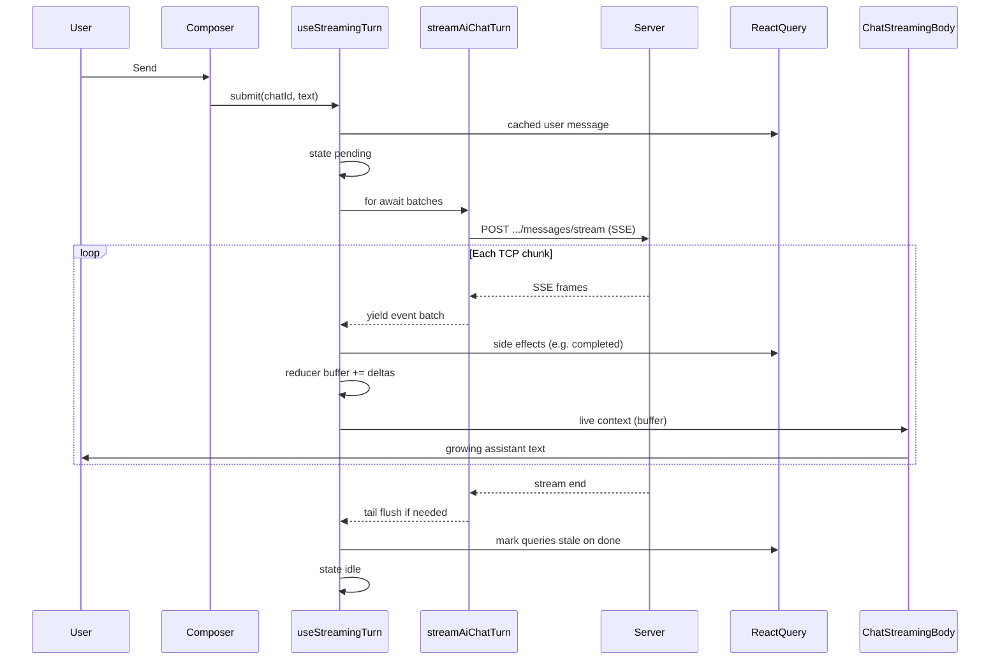

# AI Assistant - streaming (portal)

Code location: `packages/portal/src/components/AiAssistant/streaming/`.

This folder contains the **live turn** path: sending a user message and showing the assistant reply while it is still being generated. Chat history, sidebar CRUD, and panel chrome live elsewhere under `AiAssistant/`.

REST paths, types, and stream event names live under `packages/portal/src/components/AiAssistant/api/` (`types.ts`, `streamEvents.ts`, `requests.ts`).

## What "streaming" means here

A normal HTTP response arrives all at once. Here the server keeps the connection open and sends **small JSON messages over time** using **SSE** (Server-Sent Events): text chunks framed as `event:` / `data:` lines, separated by an empty line.

The UI does **not** wait for the full answer. It reads the stream, updates local state after each network chunk, and re-renders the assistant message as text grows.

You cannot use the browser `EventSource` API for this flow (it only supports GET). The portal uses `fetch()` plus a `ReadableStream` reader instead.

## Folder layout

| Path                   | Role                                                                                      |
| ---------------------- | ----------------------------------------------------------------------------------------- |
| `streaming/transport/` | SSE parsing on an open stream body: bytes -> `AiChatStreamEvent[]`                        |
| `streaming/turn/`      | Turn state machine, React Query cache updates, submit/abort                               |
| `streaming/markdown/`  | `normalizeStreamingMarkdown.ts` only - closes unfinished fenced blocks during stream      |
| `ui/markdown/`         | `MarkdownViewer`, `CodeBlock`, `markdownMode` - shared Markdown render (history + stream) |

Shared API types (`AiChatStreamEvent`, messages, roles) stay in `api/types.ts`. Stream POST and REST live in `api/` (`requests.ts`, `client.ts`, `errors.ts`). Event name constants are in `api/streamEvents.ts`.

UI wiring: message list and jump button in `ui/conversation/`, composer in `ui/composer/`, screens in `ui/screens/`. See **React context** below for which hook each component uses.

## React context (`state/`)

`useStreamingTurn` runs inside `AiAssistantProvider` and exposes three separate context values so high-frequency buffer updates do not re-render unrelated UI (header button, panel shell, composer, history list).

| Context / hook             | Fields                                                                 | Updates when                                       | Typical consumers                                                                                           |
| -------------------------- | ---------------------------------------------------------------------- | -------------------------------------------------- | ----------------------------------------------------------------------------------------------------------- |
| `usePanel()`               | `open`, `screen`, `activeChatId`, navigation callbacks, `startNewChat` | Panel open/close, screen switch, chat selection    | `AiAssistantButton`, `AiAssistantPanel`, `PanelHeader`, `MarkdownViewer` (internal links), delete-chat hook |
| `useStreamingActions()`    | `submit`, `abort`, `reset`                                             | Stable for a mounted provider                      | `Composer`                                                                                                  |
| `useStreamingTurnStatus()` | `isBusy`, `activeTurnChatId`                                           | Turn start/end, chat ID change (not on each token) | `Composer`, `HistoryScreen` (delete disabled while turn runs)                                               |
| `useStreamingLive()`       | `state` (`StreamingTurnState`), `thinkingDuringAssistantPause`         | Each assistant delta, thinking poll                | `ChatStreamingBody` only                                                                                    |

`ChatStreamingBody` is the only component that subscribes to **live** context during chat. `ChatScreen` keeps React Query + welcome/placeholder layout; it does not read streaming context directly.

Panel width is **not** in context: `AiAssistantPanel` stores it in local state + `localStorage` (`apihub.aiAssistant.panelWidth`).

Types for the three streaming slices are defined once in `state/panelContext.ts` and reused by `useStreamingTurn` return values.

## End-to-end flow



## Layer 1 - API + transport

**HTTP:** `postAiChatMessageStream` in `api/requests.ts` opens `POST /api/v1/ai-chat/chats/{chatId}/messages/stream` with `{ content, clientMessageId }` and returns the `Response` (or throws via `toAiChatHttpError`).

**SSE parsing:** `streamAiChatTurn` in `streaming/transport/sse.ts` (an **async generator**). Steps after the POST succeeds:

1. Read the response body in chunks (`reader.read()`).
2. `sseFramer.ts` splits the text buffer into complete SSE frames (frames end with `\n\n`).
3. Each frame's `data:` line is JSON -> `AiChatStreamEvent`.
4. **Yield once per TCP read** with all events parsed from that chunk.
5. **Tail flush:** when the connection closes, append `\n\n` once, parse any leftover frame, yield it, then stop.

Event types the turn layer cares about most:

| Event                         | Effect on UI state                                                          |
| ----------------------------- | --------------------------------------------------------------------------- |
| `message.assistant.start`     | Turn moves to "started", new assistant `messageId`                          |
| `message.assistant.delta`     | Append `delta` string to in-memory `buffer`                                 |
| `message.assistant.completed` | Final message written to React Query cache                                  |
| `error`                       | `fetch-error` toast + cached assistant message if any                       |
| `done`                        | Messages stale every turn; chat list stale only on first turn of a new chat |

Other events (`tool.started`, `tool.completed`, `context.compacted`, ...) are part of the backend contract but are **not** rendered yet. They still affect UX indirectly (see Thinking below).

## Layer 2 - Turn (`streaming/turn/`)

**Entry point:** `useStreamingTurn` - used from `AiAssistantProvider`, split across actions / turn-meta / live contexts.

### Turn states

| State     | What the user sees                                                   |
| --------- | -------------------------------------------------------------------- |
| `idle`    | No active generation                                                 |
| `pending` | User message shown; **Thinking** (waiting for first assistant token) |
| `started` | Live assistant bubble with text from `buffer`                        |

`streamingTurnReducer.ts` holds `buffer` and status. `useStreamingTurnSseBatchProcessor` / `processStreamingTurnSseBatch` apply side effects (cache, toasts) then `dispatchTurn`.

React Query:

- **Cached user message** is prepended immediately on send.
- On **completed**, the final assistant row is prepended to the cache.
- On **abort** or **error** with streamed text, a cached assistant message may be saved.
- On **done**, `invalidateAiChatMessagesQuery(..., { refetchType: 'none' })` every turn.
- Chat list: `invalidateAiChatListQueries(..., { refetchType: 'none' })` on `createAiChat`. After `done`, `useAiChatTitlePolling` polls `GET /chats/:id` and `syncAiChatCaches` patches that chat in item + list caches.

### "Thinking" during tool / network gaps

While status is `started`, only `message.assistant.start` / `delta` refresh a "last text activity" timestamp. Other SSE events can leave the turn in `started` **without new text** for a while.

A **short poll** (`STREAM_THINKING_POLL_MS` in `streamingTurnConstants.ts`, `useAssistantThinkingDuringPause.ts`) shows **Thinking** if no assistant token arrived for ~1s.

### Errors and the global handler

AI Chat sets `forceSnackbar: true` so 500/400 never replace the portal under the open panel (`api/errors.ts`).

After the SSE read loop, if `isStreamingBusy(stateRef)` is still true, the hook shows a **warning** snackbar with `STREAM_INCOMPLETE_MESSAGE` - HTTP 200 but no terminal event.

### Stream HTTP 404

`toAiChatHttpError` does not dispatch on 404; `useStreamingTurn` clears caches and `resetActiveChat()` when the active chat was deleted (no toast).

## Layer 3 - Live Markdown (`ui/markdown/` + `streaming/markdown/`)

While streaming, `ChatAssistantMessage` uses `MARKDOWN_MODE.streaming`: GFM without syntax highlighting, via `CodeBlock` with header hidden (`ui/markdown/`).

When the turn ends, the same message renders in **full** mode (highlighting, copy button) using authoritative `content` from the cache after `completed`.

`streaming/markdown/normalizeStreamingMarkdown.ts` closes unfinished fenced code blocks during streaming so raw `` ``` `` lines do not flash on screen.

## What lives outside `streaming/`

| Location                                | Responsibility                                         |
| --------------------------------------- | ------------------------------------------------------ |
| `state/panelContext.ts`                 | Panel + streaming actions/meta/live types and hooks    |
| `state/AiAssistantProvider.tsx`         | Hosts `useStreamingTurn`, nests four context providers |
| `ui/screens/ChatScreen.tsx`             | Welcome vs thread layout; mounts `ChatStreamingBody`   |
| `ui/conversation/ChatStreamingBody.tsx` | Subscribes to live context; renders `ChatMessageList`  |
| `ui/composer/Composer.tsx`              | Turn meta + actions (Send/Stop)                        |
| `ui/header/PanelHeader.tsx`             | Header chrome                                          |
| `ui/markdown/MarkdownViewer.tsx`        | Shared Markdown viewer (history + stream)              |
| `api/*`                                 | REST client, paths, errors, stream POST, hooks         |

## Unit tests

| Area                             | Files                                                                       |
| -------------------------------- | --------------------------------------------------------------------------- |
| SSE framing                      | `sseFramer.unit-test.ts`, `sseFrameParser.unit-test.ts`                     |
| Turn reducer / post-stream guard | `streamingTurnReducer.unit-test.ts`, `streamingTurnPostStream.unit-test.ts` |
